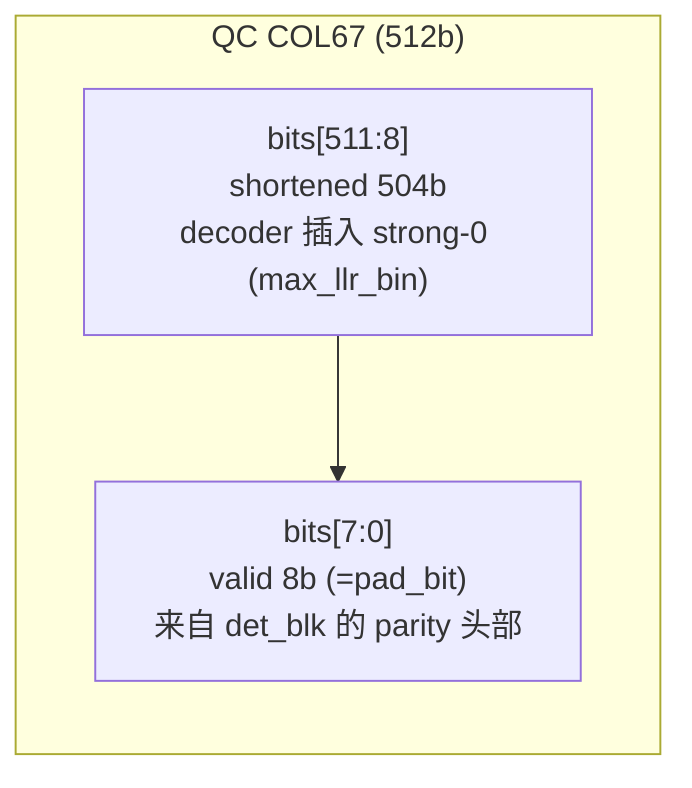
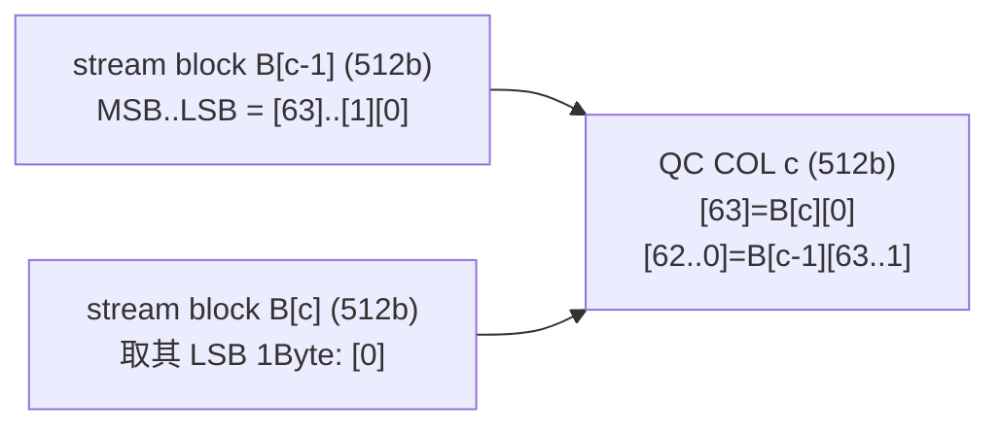

# DV Bug Report：`pad_bit`(shortening) 场景下 RDEC2 `hdmem` dump “偏移/列号错位”说明

## 1. 复现配置（来自本次对话）

- QC 参数：`bm_m=10`、`bm_n=77`、`Z(sc)=512`
- shortening：`pad_bit=8`（byte 对齐）
- 码字：全 1（用于观察现象）

长度域（DV 物理视图，见 `DVCtrans/IBEXsrc/MP_Framework/README.md` 的 Gen4 口径）：

- shortened 位数：`mask_len = Z - pad_bit = 512 - 8 = 504`
- `info_len = 67*512 = 34304`
- 物理 parity：`hm_m_phys = bm_m*Z - mask_len = 10*512 - 504 = 4616 = 9*512 + 8`
- 物理 codeword：`hm_n_phys = bm_n*Z - mask_len = 77*512 - 504 = 38920 = 76*512 + 8`
- 物理传输长度：`blk_len = info_len + hm_m_phys = 38920`

> 注意：`ldpc_codec.cpp` 内核的“QC 译码视图”仍按 `bm_n*Z = 77*512 = 39424` 组织（列视图固定 512b/col）；DV 侧 `blk_len/hm_*_phys` 是“去掉 shortened bit 之后”的物理长度。

---

## 2. 现象（对话中出现的典型例子）

1) `enc_data` 以 512b 切块观察时：第 `76` 块（0-based）几乎全 0，仅最后 1Byte 非 0。  
2) RDEC2 对齐 `hdmem` 时：`pad_bit=0` 可对齐；`pad_bit=8` 时出现：
   - **列号错位**（例如 RTL 在 `col72` 打印，而 C-model 在 `col73` 才出现对应数据）
   - **整体 1Byte 偏移/拼接**（像是左/右移 1Byte，且“少了最后 1Byte / 多了开头 1Byte”）
3) `rdec_hdmem_dump` 第一次出现 `COL67` 时常见形态：`000...00ff`（几乎全 0，仅最右侧 1Byte 有效/非 0）。

---

## 3. 结论（TL;DR，给 DV 同事的版本）

这不是“算法算错/RTL 功能错”的典型征兆，而是**拿两种不同的数据视图在硬对比**导致的：

- RTL/TB 常用的是 **stream/物理视图**：把 `blk_len` 个 bit 当作连续流再按 512b 切块（最后一块可能是不满 512b 的 tail）。
- C-model 的 `rdec_hdmem_dump` 是 **QC/译码视图**：按 base-matrix 的 `COL[0..bm_n-1]` 打印，每列固定 512b（内部在 `ldpc_decoder()` 会把 shortened 的 504b 插回去，作为 strong-0）。

当 `pad_bit=8` 时，从 `COL68` 开始 QC 列边界相对 stream 的 512b 切块边界 **错开 8bit (=1Byte)**，因此出现“col+1 / 1Byte 拼接”现象是**预期行为**；要对齐必须把两边转到同一视图。

---

## 4. 数据流与两种视图（形象化）


对比时的核心点：

- 你在 RTL/TB 里按 512b 切出来的“第 N 块”，并不等价于 C-model dump 里的“`COLN`”（`pad_bit>0` 时从第一列 parity 开始就不等价）。

---

## 5. 为什么 `enc_data` 的“只有 1Byte 有效”出现在 block76（而不是 block67）

物理长度：`blk_len = 76*512 + 8`，所以**只有最后一块**会出现“不满 512b 的 tail”。


因此：你在 `enc_data[76]` 看到“几乎全 0，只有 1Byte 非 0”，本质上只是 **stream 末尾 tail** 的表现；它不直接等价于“第一列 parity（QC 的 COL67）”。

补充一点：`COL67` 的那 `8b`（有效 parity）其实在 **`B[67]` 的某 1Byte 位置**；但同一个 `B[67]` 里剩余的 `504b` 会继续装入后续 `COL68` 的数据，所以 `B[67]` 本身通常**不会**呈现“除 1Byte 外全 0”的稀疏形态。

---

## 6. 为什么 `hdmem` 对比会出现 “col+1 + 1Byte 拼接”

### 6.1 COL67 是“分数列”（fractional parity column）

在 QC 视图里，`COL67` 固定是 512b；但 `pad_bit=8` 时它只有低 8b 是物理传输的 parity，其余高 504b 是 shortened（译码前会被补回 strong-0）：



这就是为什么 `rdec_hdmem_dump` 第一次出现 `COL67` 时，形态常像：`000...00ff`（仅最右侧 1Byte 对应 `bits[7:0]`）。

> bit/hex 方向：C-model 的 `rdec_hdmem_dump` 最左侧是 `bit[511]`，最右侧是 `bit[0]`（见 `DVCtrans/IBEXsrc/MP_Framework/RDEC_core.md:32`）。

### 6.2 从 COL68 开始：QC 列由相邻两个 512b stream block 拼起来（偏移 1Byte）

把物理 bitstream（长度 `blk_len`）按 512b 切成 `B[i]`（0-based）后，有：

- `B[0..66]` 与 `COL[0..66]` 一一对齐（因为 `info_len` 正好是 `67*512`）。
- `COL67` 需要“插入 504b strong-0”才能变回 512b 列。
- 对 `COL c (c>=68)`：其 512b 由 `B[c-1]` 和 `B[c]` **以 1Byte 粒度拼接**得到：

```text
COL[c] = (B[c-1] >> 8) | ((B[c] & 8'hFF) << 504)    // pad_bit=8
```

等价的 byte 视图（MSB..LSB）更直观：

```text
COL[c].byte63 = B[c].byte0
COL[c].byte62..byte0 = B[c-1].byte63..byte1
```



所以你看到的典型对话例子：

- RTL：`itr0 layer0 col72` 打 `h592f_7efc_0ab1...`
- C-model：`itr0 layer0 col73` 才出现 `ha459_2f7e_fc0a...`

可被解释为：`COL73` 由 `B72` 去掉 LSB 1Byte 后右移，并由 `B73` 的 LSB 1Byte 补到 MSB 侧（正好表现为“多了开头 1Byte，少了结尾 1Byte”）。

---

## 7. 建议的对齐方式（DV/RTL 对拍策略）

### 7.1 若要对齐到 C-model 的 `rdec_hdmem_dump`（QC COL 视图）

建议在 TB/脚本侧把 RTL 的 stream block `B[i]` 先做一次“rebuild QC”映射，再去和 C-model 的 `COL` 对齐：

- `COL[0..66] = B[0..66]`
- `COL67 = { 504b 0 , B[67].LSB[7:0] }`（其余位固定 0/strong-0）
- `COL[c>=68]` 用上节的 1Byte 拼接公式生成

对齐后再比较 `(itr,layer,col)` 的 512b dump。

### 7.2 若要对齐到 RTL/TB 的 “按 512b 切块”视图

则应避免直接用 C-model 的 `rdec_hdmem_dump`（QC 列视图）去对比；改为 dump/比较物理视图：

- C-model：dump `det_blk`（或 `dec_blk`）的连续 `blk_len` bitstream，再按 512b 切块比较
- RTL：同样按物理顺序输出 `blk_len` 的 bitstream

---

## 8. 关键代码位置（MP_Framework）

1) **编码端：只发送第一列 parity 的低 `pad_bit`**
   - `DVCtrans/IBEXsrc/MP_Framework/ldpc_codec.cpp:2774`：`skip_parity_bits_in_first_parity_column` 计算
   - `DVCtrans/IBEXsrc/MP_Framework/ldpc_codec.cpp:2807`：`j==(cols-rows)` 且 `k < (512 - skip...)` 只输出低 8b

   关键代码形态（节选）：

   ```cpp
   } else if (j == (h_matrix.cols - h_matrix.rows)) { // first parity col (COL67)
     if (k < (512 - skip_parity_bits_in_first_parity_column)) { // pad_bit=8 -> k<8
       tx_blk[bit_location++] = ldpc_encoder_output.c[j].b[k];
     }
   }
   ```

2) **配置端：生成 `mask`（last-row + extra_bits_of_parity）**
   - `DVCtrans/IBEXsrc/MP_Framework/ldpc_codec.cpp:2173`：`extra_bits_of_parity>0` 时按 last-row occupied 生成 `h_matrix.mask[j][k]`

3) **译码前：rebuild QC（插入 shortened 504b strong-0）**
   - `DVCtrans/IBEXsrc/MP_Framework/ldpc_codec.cpp:2979`：说明 det_blk 不包含 shortened tail bits
   - `DVCtrans/IBEXsrc/MP_Framework/ldpc_codec.cpp:2985`：插入 `max_llr_bin` 到 `dec_di_blk`

4) **译码后：slice 回物理 stream（去掉同一段 shortened bits）**
   - `DVCtrans/IBEXsrc/MP_Framework/ldpc_codec.cpp:3028`：说明 `dec_do_blk`(QC) 与 `dec_blk`(物理) 的差别
   - `DVCtrans/IBEXsrc/MP_Framework/ldpc_codec.cpp:3038`：按 `extra_bits_of_parity` 把 `dec_do_blk` 切回 `dec_blk`

5) **RDEC2 的 LLR 使用：补齐不是“只影响打印”，而是译码输入本身**
   - `DVCtrans/IBEXsrc/MP_Framework/ldpc_codec.cpp:3895`：`cn_q_mem[i][j] = llr_tbl[dec_di_blk[i*Z+j]]`

6) **`rdec_hdmem_dump` 的 bit/hex 打包方向**
   - `DVCtrans/IBEXsrc/MP_Framework/RDEC_core.md:32`：最左侧是 `bit[511]`，最右侧是 `bit[0]`

---

## 9. FAQ（对 DV 同事常见追问的答法）

### Q1: “补齐/插入 shortened bit”只是打印用吗？还是译码也用？

译码也用。`dec_di_blk` 是 RDEC2 的直接输入，shortened 的 504b 在进入 `ldpc_dec_layer2()` 前就被写成 `max_llr_bin`（strong-0）。见 `DVCtrans/IBEXsrc/MP_Framework/ldpc_codec.cpp:2985` 与 `:3895`。

### Q2: `k < (512 - skip...)` 发的是高 8bit 还是低 8bit？

发的是 **低 8bit**（`k=0..7`）。对应到 `rdec_hdmem_dump` 的 hex，就是“最右侧 1Byte”（`bit[7:0]`）。见 `DVCtrans/IBEXsrc/MP_Framework/ldpc_codec.cpp:2808` 与 `DVCtrans/IBEXsrc/MP_Framework/RDEC_core.md:32`。

### Q3: 为什么可以补 0，不会破坏校验关系吗？

这是 shortening 的定义：被省略的 504b 在码字中被固定为 0，不传输；译码端必须把它们恢复为“已知为 0”的强信息（strong-0 LLR），这样 QC 的校验约束才与真实码字结构一致。

### Q4: `pad_bit != 0` 时，第一列 parity 是否要“整列 mask 掉”？

不应整列 mask 掉。QC 视图下该列仍然存在 512b，其中 **只有 504b 是 shortened/fixed-0**，低 `pad_bit` 仍是有效 parity bit。IBEX 的做法是用 `mask`/`~mask` 在 lane 级别拆分（见 `DVCtrans/IBEXsrc/MP_Framework/ldpc_codec.cpp:2173` 生成 mask；以及 `IBEX/doc/ibex.md:53` 的 `mask_for_row` 伪码：`mask_row?mask : fade_row?~mask : ...`）。

---

## 10. 如何用 IBEX 输出文件“实锤” fade 被纳入（`Ibex_hd_row10.cnfg` / `10x77ex512_w4`）

如果你想用 **IBEX 生成的 matrix/schedule 输出**来确认“shortening(`pad_bit!=0`) 时确实引入了 `fade` CPM（而不是只在口头/文档里说有）”，可以只看下面两份文件：

- `IBEX/output/bm_schematic_10x77ex512_w4.txt`
- `IBEX/output/rdec_sched_10x77ex512_w4.txt`

### 10.1 从 `bm_schematic` 看：`COL67` 这一列确实存在 `fade` CPM

`bm_schematic_10x77ex512_w4.txt` 有 3 段：

1) Base-matrix schematic：只表示 `occupied`（`1/0/X`）  
2) Fade matrix：只表示 `fade`（`1/.`）  
3) Base-matrix schematic (fade shown as `*`)：把 `fade` 标成 `*`（更直观）

在该文件的 header 里写明：`base_userdata_cols=64, extra_userdata_cols=3, parity_cols=10`，因此 **parity 的第一列就是全局的 `COL67`**（`64+3=67`）。

- Base-matrix schematic 里，`ROW 5..9` 的 parity 段第 1 位都是 `1` → 说明 `COL67` 在这 5 个 row 上有 CPM：  
  见 `IBEX/output/bm_schematic_10x77ex512_w4.txt:12`、`:13`、`:14`、`:15`、`:16`。
- Fade matrix 里，只有 `ROW 7` 的 parity 段第 1 位是 `1` → 说明 `(ROW7,COL67)` 是 `fade CPM`：  
  见 `IBEX/output/bm_schematic_10x77ex512_w4.txt:29`。
- “fade shown as `*`” 里，`ROW 7` parity 段第 1 位是 `*`，而 `ROW 9` parity 段第 1 位仍是普通 `1` → 这列同时存在 `fade` 与 last-row `occupied`：  
  见 `IBEX/output/bm_schematic_10x77ex512_w4.txt:44`、`:46`。

### 10.2 从 `rdec_sched` 看：`COL67` 的 schedule 里确实包含 `fade` 对应的 entry（`mask_flag=1`）

`rdec_sched` 每行是一个 44-bit 的 scheduler word（实际有效 42b），字段见 `IBEX/src/ldpc_codec.cpp:718` 及后续 packing：

- `[6:0] col`
- `[15:7] shift`
- `[32] mask_flag`：shortening 模式下 **`fade` 或 **last-row** 的 CPM 会置 1（见 `IBEX/src/ldpc_codec.cpp:948`～`:953`）
- `[41:33] mask_shift`：该列 last-row 的 shift（signed）

把 `IBEX/output/rdec_sched_10x77ex512_w4.txt` 里所有 `col==67` 的 word 解码后，可以得到：

- `col=67` 一共 **5** 条 entry（对应上面 `ROW5..9` 的 5 个 CPM）
- 其中 **2** 条 `mask_flag==1`（一条是 `fade`，一条是 last-row）
- 且该列 `mask_shift==0`（说明 last-row 的 circulant shift 是 0）

具体两条 `mask_flag==1` 的 word（地址为 `10'd...`）如下：

```text
10'd280: 44'h00107A6B143  col=67 shift=354 mask_flag=1 mask_shift=0  -> fade (ROW7,COL67)
10'd352: 44'h0010B680043  col=67 shift=0   mask_flag=1 mask_shift=0  -> last-row occupied (ROW9,COL67)
```

识别方式很直接：`mask_shift` 在代码里就是“该列 last-row 的 shift”（见 `IBEX/src/ldpc_codec.cpp:904`～`:909`），所以 `shift==mask_shift(=0)` 的那条就是 last-row；同列另一条 `mask_flag==1` 且 `shift!=0` 就是 `fade` entry。

> 结论：`bm_schematic` 能看到 `fade` 位置；`rdec_sched` 能看到对应的 schedule entry（且被标记为 `mask_flag=1`），因此可以确认 “生成/处理链路”确实把 `fade` 纳入了 QC base-matrix / RDEC schedule，而不是仅在打印层面做解释。
