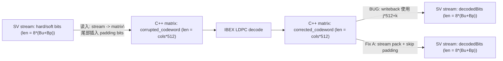

# IBEX DV：`parity=321B` 时译码 `segmentation fault`（OOB）定位记录与方案A

> 目标：记录一次在 `DVCtrans/IBEXsrc/DVsrc` 中复现的 `segmentation fault`（`parity=321B`），给出可复现的证据链、根因模型，以及推荐修复方案A（保持 SV `decodedBits` 为 stream 长度，C++ 写回时按 stream 打包并跳过 padding bits）。

## 1. 现象与触发条件

- 场景：4K LDPC（`cir_sz=512`，即每列 `64B/512bit`）。
- 配置：
  - `user_data_bytes = 4096`（64B 对齐）
  - `parity_bytes = 320`：编解码正常
  - `parity_bytes = 321`：注错后进入译码模块出现 `segmentation fault`
- 已确认（SV 侧）：
  - `decodedBits` 为 bit-stream 数组，元素取值为 `0/1/2/3`（与软信息/level 编码相关；至少 hardbit 为 `0/1`）。
  - `decodedBits` 的数组长度为 `(user_data_bytes + parity_bytes) * 8`。

> 注：此处 “长度” 指 bit 数。DV 侧 open array 多为 `[0:len-1]`，因此 `len = svHigh(handle,1)+1`。

## 2. 最小定位手段：单点 OOB 打印

在 `DVCtrans/IBEXsrc/DVsrc/ldpc_decoder.cpp` 的输出写回循环处加入最少量打印（只在即将越界时打印一次并 `return`），观察到了：

- 打印：`idx=35336, decode_len=35336 (j=69,k=8) cols=70 bits=512 user=4096B parity=321B`

含义是：写回时计算出的目标索引 `idx` 等于 SV 数组长度 `decode_len`，因此出现越界写（合法下标应为 `0..decode_len-1`）。

建议的最小打印代码段（定位用，避免继续踩内存导致崩溃）：

```cpp
const int decoded_len = svHigh(sv_decodedBits, 1) + 1; // SV 数组元素个数（bit）
for (int j = 0; j < inst->h_matrix.cols; j++) {
  for (int k = 0; k < inst->h_matrix.bits; k++) {
    const int idx = j * 512 + k; // 现有实现的写回索引
    if (idx >= decoded_len) {
      fprintf(stderr,
              "[DBG] OOB write: idx=%d decoded_len=%d (j=%d k=%d) cols=%d bits=%d user=%dB parity=%dB\n",
              idx, decoded_len, j, k, inst->h_matrix.cols, inst->h_matrix.bits, user_data_bytes, parity_bytes);
      fflush(stderr);
      return;
    }
    unsigned char* p = (unsigned char*)svGetArrElemPtr(sv_decodedBits, idx);
    *p = inst->ldpc_decoder_output.corrected_codeword.c[j].b[k]; // 字段名按你工程实际为准
  }
}
```

## 3. 长度模型：stream 与 matrix 的“不一致”是必然的（只要存在尾部非整列）

### 3.1 两种长度定义

- SV 侧 `decodedBits` 长度（stream）：
  - $L = 8(B_u + B_p)$，其中 $B_u$ 为 userdata 字节数，$B_p$ 为 parity 字节数。
- IBEX/DV C++ 内部 codeword 矩阵长度（matrix）：
  - 每列 $Z = 512$ bit（4K LDPC 固定）。
  - payload 列数 $C_u = \lceil B_u/64 \rceil$
  - parity 列数（也等于 `rows`）$C_p = \lceil B_p/64 \rceil$
  - 总列数 $C = C_u + C_p$
  - 矩阵 bit 长度 $L_{mat} = C \cdot 512$

当 $B_u$ 或 $B_p$ 不是 64B 对齐时，`ceil` 会增加列数，从而 $L_{mat}$ 增加一个整列 512bit，但 $L$ 只增加了实际字节对应的 bit 数；两者差值就是 padding bits。

### 3.2 320B 不崩、321B 崩的定量解释（你遇到的 case）

- `B_u=4096B`：$C_u = 4096/64 = 64$
- `B_p=320B`：$C_p = 320/64 = 5$
  - $C = 69$
  - $L = 8(4096+320) = 35328$
  - $L_{mat} = 69 \cdot 512 = 35328$
  - $L = L_{mat}$，因此用 `idx=j*512+k` 写回不会越界。
- `B_p=321B`：$C_p = \lceil 321/64 \rceil = 6$
  - $C = 70$
  - $L = 8(4096+321) = 35336$
  - $L_{mat} = 70 \cdot 512 = 35840$
  - 差值 $L_{mat}-L = 504$ bit（即 63B padding），因此仍按 `idx=j*512+k` 写回会在 `idx=35336` 处第一次越界（与你的打印完全一致：`j=69,k=8 -> 69*512+8 = 35336`）。

## 4. 源码层证据：DV 已在“读入”阶段插入 padding，但“写回”阶段没有剔除

### 4.1 DVsrc 读入（stream -> matrix）确实插了 padding

`DVCtrans/IBEXsrc/DVsrc/ldpc_decoder.cpp` 读入阶段，会在

- 最后一列 payload 的尾部（userdata 非整列时）
- 第一列 parity 的尾部（parity 非整列时）

写入 0，并且不消耗 `hardbit_data[]` 的 stream 索引（即 `bit_index` 不++）。

相关代码段（节选，逻辑上与 `IBEX/src/ldpc_codec.cpp` 一致）：

```cpp
int fractional_bytes_of_userdata = user_data_bytes - ((user_data_bytes >> 6) << 6);
int fractional_bytes_of_parity   = parity_bytes    - ((parity_bytes    >> 6) << 6);
int unused_bytes_of_userdata = (fractional_bytes_of_userdata == 0) ? 0 : (64 - fractional_bytes_of_userdata);
int unused_bytes_of_parity   = (fractional_bytes_of_parity   == 0) ? 0 : (64 - fractional_bytes_of_parity);
int unused_bits_of_userdata = unused_bytes_of_userdata << 3;
int unused_bits_of_parity   = unused_bytes_of_parity   << 3;
int bit_index = 0;

for (int j = 0; j < inst->h_matrix.cols; j++) {
  for (int k = 0; k < inst->h_matrix.bits; k++) {
    if ((j == (inst->h_matrix.cols - inst->h_matrix.rows - 1)) &&
        (k >= (inst->h_matrix.bits - unused_bits_of_userdata))) {
      inst->ldpc_decoder_input.corrupted_codeword.c[j].b[k].bit_hard = 0;
      ...
    } else if ((j == (inst->h_matrix.cols - inst->h_matrix.rows)) &&
               (k >= (inst->h_matrix.bits - unused_bits_of_parity))) {
      inst->ldpc_decoder_input.corrupted_codeword.c[j].b[k].bit_hard = 0;
      ...
    } else {
      inst->ldpc_decoder_input.corrupted_codeword.c[j].b[k].bit_hard = hardbit_data[bit_index];
      ...
      bit_index++;
    }
  }
}
```

结论：内部 `corrupted_codeword` 的“矩阵长度”永远是 `cols*512`，而外部 `hardbit_data` 仍是 stream 长度 $L$。

### 4.2 DVsrc 写回（matrix -> stream）仍按矩阵索引写，导致 OOB

当前写回逻辑等价于把 `corrected_codeword` 的完整矩阵（含 padding bits）平铺写回 SV 数组：

```cpp
for (int j = 0; j < inst->h_matrix.cols; j++) {
  for (int k = 0; k < inst->h_matrix.bits; k++) {
    unsigned char* p = (unsigned char*)svGetArrElemPtr(sv_decodedBits, j * 512 + k);
    *p = inst->ldpc_decoder_output.corrected_codeword.c[j].b[k];
  }
}
```

当 $L_{mat} > L$ 时，`j*512+k` 会超过 SV 数组范围，从而触发 `segmentation fault`。

## 5. “实验A”为何能“修复”崩溃（但不推荐作为最终方案）

实验A改动：把 SV 侧 `decodedBits` 的长度从 $L$ 临时扩展为 $L_{mat}=cols*512$（即让 SV 数组足够大）。

为什么崩溃消失：因为越界写被“扩大数组”掩盖了，本质仍是在把 padding bits 一并写回。

为什么不推荐：SV/DV 的其它模块若认为 `decodedBits` 是严格的 stream（$L$），扩大数组可能引入额外无效 bit 的处理歧义；更重要的是，这会隐藏“写回阶段缺失 remove padding”的设计缺陷。

## 6. 推荐解决方案A：保持 SV 为 stream 长度，C++ 写回时按 stream 打包并跳过 padding bits

目标：输出只包含真实有效 bit（总数 $L$），跳过 matrix 中插入的 padding bits，使 “读入插 padding / 写回去 padding” 成对。

核心思路：使用一个独立的 `out_bit_index`（范围 `0..L-1`）作为 SV 写回索引，而不是用 `j*512+k`。

示例实现（建议直接替换写回循环；字段名按你工程实际调整）：

```cpp
const int decoded_len = svHigh(sv_decodedBits, 1) + 1;
const int stream_len  = (user_data_bytes + parity_bytes) * 8;

if (decoded_len != stream_len) {
  fprintf(stderr, "[WARN] decodedBits length mismatch: sv=%d stream=%d\n", decoded_len, stream_len);
}

const int last_payload_col = inst->h_matrix.cols - inst->h_matrix.rows - 1;
const int first_parity_col = inst->h_matrix.cols - inst->h_matrix.rows;
const int unused_bits_userdata = inst->h_matrix.unused_bytes_of_userdata * 8;
const int unused_bits_parity   = inst->h_matrix.unused_bytes_of_parity   * 8;

int out_bit = 0;
for (int j = 0; j < inst->h_matrix.cols; j++) {
  for (int k = 0; k < inst->h_matrix.bits; k++) {
    const bool is_padding =
        ((unused_bits_userdata > 0) && (j == last_payload_col) && (k >= inst->h_matrix.bits - unused_bits_userdata)) ||
        ((unused_bits_parity   > 0) && (j == first_parity_col) && (k >= inst->h_matrix.bits - unused_bits_parity));

    if (is_padding) continue;

    if (out_bit >= decoded_len) {
      fprintf(stderr,
              "[ERR] stream write exceeds decodedBits: out_bit=%d decoded_len=%d (j=%d k=%d)\n",
              out_bit, decoded_len, j, k);
      fflush(stderr);
      return;
    }

    unsigned char* p = (unsigned char*)svGetArrElemPtr(sv_decodedBits, out_bit);
    *p = inst->ldpc_decoder_output.corrected_codeword.c[j].b[k];
    out_bit++;
  }
}

if (out_bit != stream_len) {
  fprintf(stderr, "[ERR] stream_len mismatch after pack: out_bit=%d stream_len=%d\n", out_bit, stream_len);
  fflush(stderr);
}
```

## 7. 机制流程图（帮助记忆：哪里插 padding，哪里必须去 padding）



## 8. 推荐验证步骤（服务器侧）

1. 先保留当前“定位打印”版本，确保能稳定复现 `parity=321B` 时的 OOB 位置（你已得到关键打印）。
2. 按方案A替换写回循环后：
   - `parity=321B` 不再 `segmentation fault`；
   - `out_bit == 8*(B_u+B_p)`；
   - 320B/321B 两种 parity 下输出 stream 的 bit 数一致，且不包含额外 padding bits。
3. 若仍有异常，请追加打印：
   - `inst->h_matrix.rows/cols/bits`
   - `inst->h_matrix.unused_bytes_of_userdata/unused_bytes_of_parity`
   - `decoded_len` 与 `stream_len`

---

### 备注：与 IBEX 主工程的对照点

- `IBEX/src/ldpc_codec.cpp` 在 `cir_sz==512` 且存在 `unused_bytes_of_parity` 时，会在译码输入/输出路径显式处理 “第一列 parity 的缺失/填充” 与 “remove padding”。
- 本次 bug 的根因，与 `mask` 机制本身无关；它是一个纯粹的 “接口长度定义（stream）” vs “内部矩阵长度（cols*512）” 的写回不一致问题。
