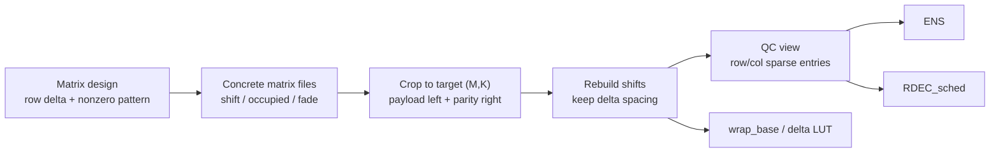
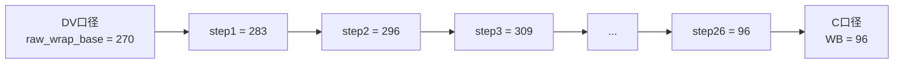
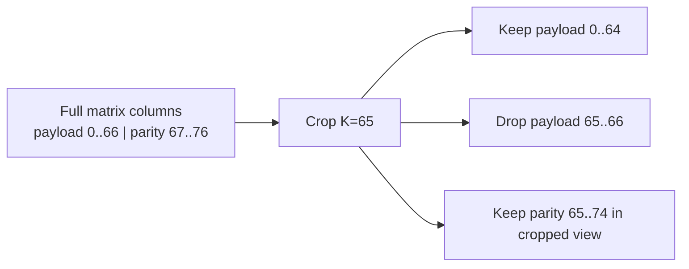
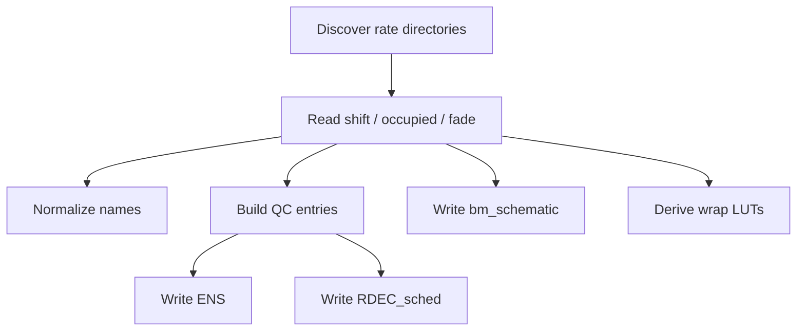
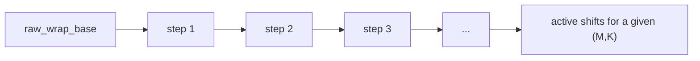
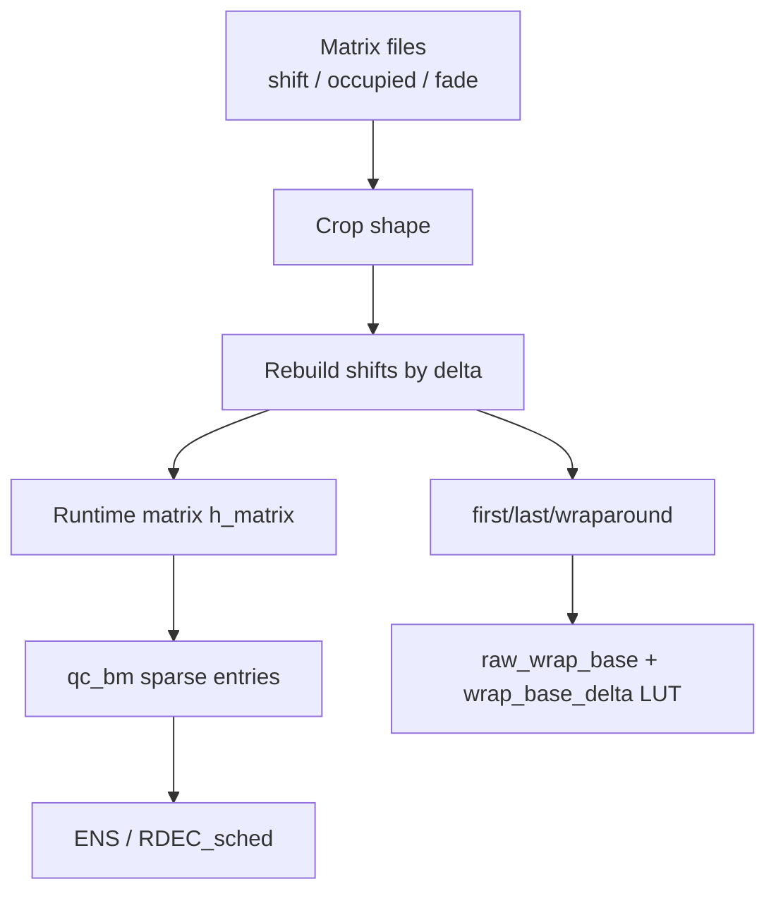

# IBEX Matrix Visual Guide

> 这份文档把两条线索整理到同一套心智模型里：
>
> - `IBEX/doc/IBEX_Matrix_LUT.md`：解释 **IBEX/src** 里矩阵/LUT 的语义
> - `IBEX/doc/ibex_matrix_visual.py`：把 **矩阵结构 / Stage 1 / Stage 2 /
>   WrapBaseDelta / FirstMaskShift** 画成可直接讨论的图
> - `scripts/ibex_matrix_family/generate_family_artifacts.py`、
>   `scripts/ibex_matrix_family/generate_family_artifacts_from_occ_fade_rtl.py`
>   与 `scripts/ibex_matrix_family/generate_family_artifacts_from_occ_fade_rtl_autobase.py`：
>   解释 **离线两段式产物生成脚本** 如何从一组已落地矩阵导出
>   `matrix / fade / occupied / ENS / assignments / RTL-aligned LUT`
>
> 它们讨论的是同一类矩阵，但处在 **不同层级**：
>
> - 前者偏 **运行时 / RTL 口径**
> - 后者偏 **离线制表 / 文件产物口径**

---

## 1. 一张总图：矩阵在系统里经历了什么



这张图里最重要的不是文件名，而是 4 个“视图”：

- **设计视图**：每一行有哪些非零 CPM、相邻 shift 差多少
- **文件视图**：`matrix / occupied / fade`
- **QC 视图**：译码器真正遍历的 `(row, col, shift)` 稀疏条目
- **LUT 视图**：DV/RTL 通过 `delta / wrap_base / wrap_base_delta` 去重建“每行相位”

---

## 2. 先抓住三个核心量

### 2.1 几何量

- `M`：base matrix 行数
- `K`：payload 列数
- `N = K + M`：base matrix 总列数
- `Z = 512`：每个 circulant 的展开长度

所以一个 `10x77` 的矩阵，意思是：

- `M = 10`
- `K = 67`
- `N = 77`
- 每个非零 CPM 实际对应一个 `512 x 512` 的循环置换块

### 2.2 三张文件表

- `matrix`：每个非零位置的 `shift`
- `occupied_matrix`：普通非零 CPM
- `fade_matrix`：fade CPM

可以把它理解成：

| 文件 | 作用 |
|---|---|
| `matrix` | 非零块“转多少格” |
| `occupied` | 这个位置是不是普通 CPM |
| `fade` | 这个位置是不是 fade CPM |

### 2.3 一行的 `delta`

每一行都有一个固定步长 `delta[row]`。  
它表示这行 **相邻非零 CPM** 的 shift 差。

例如某行 `delta = 19`，则这一行沿着非零 CPM 走，shift 序列会像：

```text
..., 415, 434, 453, 472, 491, 510, 17, 36, ...
```

关键点：

- `delta` 是 **行属性**
- 不是列属性
- 不是每个 CPM 独立自带的值

### 2.4 一个最小玩具矩阵：先把“行里的节奏”看出来

先不要看 `10x77`。先看一个玩具行：

```text
row 2, delta = 3, Z = 16

列号:      0   1   2   3   4   5   6   7
类型:      1   0   F   1   0   1   0   0
shift:     2       5   8       11
```

这里：

- `1` = occupied
- `F` = fade
- `0` = zero CPM

这行真正“参与相位链”的位置只有 4 个：

```text
2 -> 5 -> 8 -> 11
```

它们之间每次都 `+3 (mod 16)`，这就是这行的 `delta = 3`。

所以可以把一整行想成：

> **一条只在非零 CPM 上前进的“齿轮链”**

zero CPM 不参与链条计步；occupied 和 fade 都占据链条上的一个齿位。

---

## 3. `IBEX_Matrix_LUT.md` 真正在讲什么

这份文档最有价值的部分，不是某个公式本身，而是它把 **两套坐标系** 区分开了。

### 3.1 坐标系 A：C model / `IBEX/src`

在 `IBEX/src/ldpc_codec.cpp` 里，矩阵最终在运行时会表现成：

- `h_matrix.element[row][col]`
- `h_matrix.first_element[row]`
- `h_matrix.last_element[row]`
- `h_matrix.wraparound[row]`

这里的 `WB`（很多打印里看到的 `WB=...`）更接近：

- 这一行当前 C 扫描时的 **起始 shift**
- 或 `last_element`

### 3.2 坐标系 B：DV / RTL LUT

DV/RTL 侧常见的是：

- `ldpc_matrix_delta_tmp_adj_ord`
- `ldpc_matrix_wrap_base_tmp_adj_ord`
- `ldpc_matrix_wrap_base_deltaX_adj_ord`

这里的 `wrap_base_tmp` 不是 C 打印里的 `WB`。  
它更像是 **raw phase origin**，也就是“这一行相位链条的原点”。

所以这两个量不要混：

| 量 | 所属口径 | 含义 |
|---|---|---|
| `WB` | C / print_hm | 当前行的运行时起点 |
| `raw_wrap_base` | DV / RTL | LUT 重建相位的原始基准 |

### 3.3 一个“同一行、两套说法”的 toy case

假设某行 active shift 是：

```text
283, 296, 309, ..., 57, 70, 83, 96
```

那么可以有两种描述方式：

#### 说法 A：C / runtime 口径

```text
WB = 96
然后从右往左每次减一个 delta=13
```

#### 说法 B：DV / LUT 口径

```text
raw_wrap_base = 270
active shifts = raw_wrap_base + step * 13
step = 1, 2, 3, ..., 26
```

两种说法描述的是**同一条相位链**，只是站的参考点不同：



所以：

- `WB` 和 `raw_wrap_base` 不是冲突
- 它们只是从**链尾**和**链原点**在看同一行

---

## 4. 裁剪到底在做什么

这是最容易讲乱的地方。

### 4.1 裁剪规则

当 full-width 是 `K=67`，但目标想要 `K=65` 时：

- 左边 payload 只保留前 `65` 列
- 右边 parity 仍保留最右侧 `M` 列
- 中间被砍掉的是 payload 尾部的 2 列



更直观一点：

```text
full:    [ payload 67 cols ][ parity M cols ]
crop65:  [ payload 65 cols ][ parity M cols ]
             ^ keep left       ^ keep right
             middle 2 payload columns are dropped
```

### 4.2 裁剪后最关键的一步：不能直接沿用旧 shift

如果只是把 full matrix 里 surviving 列的 shift 生硬拷出来，会出问题：

- surviving 的非零 CPM 之间不一定还差一个 `delta`
- `last_row` 的 shift 可能和 DUT 侧按 delta 重建的结果对不上
- `mask_shift` 也会跟着错

所以当前正确口径是：

1. 先裁 `occupied/fade` 的 **形状**
2. 再按每行固定 `delta` **重新生成 shift**

这一步的目标很简单：

> 裁剪后，新的相邻非零 CPM，仍然保持单步 `delta`

### 4.3 一个更具体的 toy case：为什么“直接裁 shift”会错

还是用小矩阵。设：

- `Z = 16`
- 某行 `delta = 3`
- full 矩阵这一行是：

|列号|0|1|2|3|4|5|6|
|---|---:|---:|---:|---:|---:|---:|---:|
|类型|1|0|F|1|0|1|0|
|shift|2|.|5|8|.|11|.|

这行 active 链是：

```text
2 -> 5 -> 8 -> 11
```

现在裁掉左边两列，只保留列 `2..6`。

#### 错误做法：直接保留 surviving shift

保留下来的会是：

|新列号|0|1|2|3|4|
|---|---:|---:|---:|---:|---:|
|来源旧列|2|3|4|5|6|
|类型|F|1|0|1|0|
|shift|5|8|.|11|.|

这一步看起来没错，但它的“起点语义”已经变了。  
你只是把值抄过来了，没有告诉系统：

> “左边已经少掉了一个 active step”

#### 正确做法：裁形状后，重新沿 delta 链排

先保留形状：

```text
F, 1, 0, 1, 0
```

再用 surviving 最右端当锚点，从右往左重生：

```text
5, 8, 11
```

或者换成“从右往左减 delta”的写法：

```text
11 -> 8 -> 5
```

重点在于：

- 你保留的是 **链条结构**
- 不是“原文件里这几个数字恰好是什么”

### 4.4 一个更贴近 IBEX 的大数值例子

假设某行原来非零序列是：

```text
415, 434, 453, 472, 491
```

且 `delta = 19`。

如果中间裁掉两个 active step，而 surviving 的最后一个点仍锚定在右边，那么重生后的序列应该仍然像：

```text
..., 36, 55, 74, 93
```

重点不是具体值，而是：

- 新序列里任意相邻两项仍差 `19`

### 4.5 一张图记住裁剪


---

## 5. `generate_family_artifacts.py` 在这套模型里处于哪一层

这份脚本不是 runtime generator。  
它不负责重新“随机生成 80 列内部矩阵”，它做的是：

> 从一组已经存在的 rate matrices 出发，批量导出各种离线产物

### 5.1 它的输入是什么

脚本读的是一批目录化的矩阵族：

```text
input_root/
  5x72/
  6x73/
  ...
  17x84/
```

每个目录下有：

- `matrix`
- `occupied_matrix`
- `fade_matrix`

脚本入口逻辑在 `discover_rates(...)`。

### 5.2 它做的事情



核心动作有 4 个：

- 发现 rate
- 读取三张矩阵
- 建立 QC entries
- 导出 `ENS / RDEC_sched / bm_schematic / LUT`

### 5.3 `build_qc_entries` 的语义

脚本里这一步特别重要。

它把“二维矩阵文件”变成“译码器会真正遍历的 entry 列表”：

```text
Entry = (row, col, shift)
```

并且要区分：

- **full parity**：只看 `occupied`
- **fractional parity / pad_bit>0**：看所有 `shift >= 0`，也就是 `occupied + fade`

这和运行时 `qc_bm` 的构造语义是一致的。

---

## 6. `RDEC_sched` 是怎么从矩阵出来的

### 6.1 先把矩阵变成列视图和行视图

脚本先拿到：

- `row_entries[row]`
- `col_entries[col]`

然后对每个 `entry(row,col,shift)` 找：

- 这一列里它前一个 circulant 是谁 `pre_entry`

也就是：

```text
pre_entry = prev_in_col(entry)
```

### 6.2 再把一个 entry 打包成 scheduler word

脚本中的 `pack_sched_word(...)` 会写入：

- `col`
- `shift`
- `pre_row`
- `shift_delta`
- `last_in_row`
- `is_extra_userdata`
- `mask_flag`
- `mask_shift`

其中最容易混的是两项：

#### `shift_delta`

不是任意差值，而是：

```text
shift_delta = entry.shift - pre_entry.shift  (mod Z)
```

#### `mask_shift`

不是当前 entry 自己的 shift。  
它取的是：

> 同一列 `last_row` 的 shift

这点是整个第一列 parity / fade / mask 机制的关键。

### 6.3 一个 `pre_row / shift_delta` toy case

看同一列里的 3 个 entry：

|entry|row|col|shift|
|---|---:|---:|---:|
|A|1|42|395|
|B|2|42|284|
|C|7|42|430|

如果当前要打包的是 `B(row=2,col=42,shift=284)`，那么：

- 它在同列前一个 circulant 是 `A`
- 所以：
  - `pre_row = 1`
  - `shift_delta = 284 - 395 (mod 512) = 401`

可以把它理解成：

```text
当前 entry 不会单独存在
它总是带着“我是接在谁后面”的信息一起发给 RTL
```

### 6.4 一个 `mask_shift` toy case

假设 `col = 67` 是 first parity 列，且这一列最底下那一行 `last_row` 的 shift 是 `275`。

那么这列里无论当前打包的是：

- last-row occupied
- 还是对应的 fade

只要它需要 mask 语义，写进 scheduler 的 `mask_shift` 都是：

```text
mask_shift = 275
```

不是：

- 当前 entry 自己的 shift
- 也不是 pre_entry 的 shift

这也是为什么：

> 只要 last_row 的 shift 两边对不上，`mask_shift` 就会跟着整体错位

---

## 7. LUT 是怎么从一组矩阵“反推”出来的

这一段是脚本最容易让人误会的地方。

### 7.1 脚本不是直接抄 C 的 `WB`

脚本在 `derive_wrap_luts(...)` 里做的是：

1. 对每个 row slot，从多组 rate 里收集 active shift
2. 推出这行的 `delta`
3. 选一组“最满”的配置作为参考
4. 反推出一个 `raw_wrap_base`
5. 再对每个 `(M,K)` 算出该行从第几个 step 开始 active

所以最终会得到：

- `delta[row]`
- `raw_wrap_base[row]`
- `wrap_base_delta[row][idx]`

### 7.2 一个 row 的心智模型



理解方式：

- `raw_wrap_base` 给出“相位原点”
- `delta` 给出“步长”
- `wrap_base_delta` 说“在这个 `(M,K)` 配置下，从第几步开始算 active”

### 7.3 一个 LUT toy case：为什么 `wrap_base_delta` 会随 `(M,K)` 变

假设某 row slot：

- `raw_wrap_base = 270`
- `delta = 13`

对于不同配置，它的 active 起点可能不同：

|配置|start step|得到的起点 shift|
|---|---:|---:|
|`M=5, K=67`|1|`270 + 1*13 = 283`|
|`M=13, K=67`|32|`270 + 32*13 mod 512 = 174`|
|`M=17, K=67`|38|`270 + 38*13 mod 512 = 252`|

所以 `wrap_base_delta` 的本质不是“另一个 delta”，而是：

> **这一行在当前配置下，从相位链的第几步开始活跃**

### 7.4 为什么会有 `adjusted_extra_rows`

脚本还导出了一套 adjusted 版本 LUT。  
原因不是数学变了，而是为了兼容旧 DV 选择器的索引方式：

- 前几行 slot 直接按 `extra_rows`
- 后几行 slot 需要按 `max(extra_rows - offset, 0)` 去选表项

也就是说：

- **delta 没变**
- **raw_wrap_base 没变**
- 变的是 **某个 row slot 在表里用哪一个 index**

### 7.5 一个 adjusted 索引 toy case

假设 row slot = 7。

对旧 DV 逻辑，它不是直接用：

```text
extra_rows = M - 5
```

而是用：

```text
adjusted_extra_rows = max(extra_rows - 3, 0)
```

所以：

|M|extra_rows|adjusted_extra_rows|
|---|---:|---:|
|5|0|0|
|6|1|0|
|7|2|0|
|8|3|0|
|9|4|1|

含义是：

- row slot 越靠后，越要“等矩阵长大以后”才开始真正向前走
- 这不是数学变了，而是 **旧 LUT 的索引压缩策略**

---

## 8. 这两份文档里最容易混淆的 5 件事

### 混淆 1：`WB` 和 `raw_wrap_base` 是一个东西

不是。

- `WB`：C 当前运行时起点
- `raw_wrap_base`：RTL LUT 相位原点

### 混淆 2：裁剪就是“删几列”

不完整。

正确说法是：

- 先裁 **非零形状**
- 再重生 **shift**

### 混淆 3：`mask_shift` 取当前 entry 的 shift

不是。  
它取的是 **该列 last_row 的 shift**。

### 混淆 4：`wrap_base_deltaX_adj_ord` 的 `X` 是 delta 值

不是。  
`X` 是 **row slot 编号**。

### 混淆 5：`generate_family_artifacts.py` 在“生成原始矩阵”

不是。  
它是在“消费一组已有矩阵文件并导出产物”。

---

## 9. 最终推荐的讲解顺序

如果你要向 DV/同事解释，建议按这个顺序讲：

1. **几何结构**  
   `M / K / N / Z` 是什么
2. **三张矩阵文件**  
   `matrix / occupied / fade`
3. **裁剪原则**  
   payload 取左边，parity 取右边
4. **为什么要重生 shift**  
   为了保持同一行相邻非零 CPM 的 `delta`
5. **QC 视图与 scheduler**  
   `Entry(row,col,shift)`、`pre_row`、`shift_delta`
6. **LUT 视图**  
   `delta + raw_wrap_base + wrap_base_delta`

如果顺序反过来，听众很容易把：

- 矩阵文件
- 运行时 `h_matrix`
- DV LUT

这三层混成一层。

---

## 9.5 如果要做成 PPT，建议每页只讲一个 toy case

推荐拆成 8 页：

1. `M / K / N / Z` 几何图
2. `matrix / occupied / fade` 三张文件是什么
3. 一条 row 的 `delta` 链
4. `K=67 -> K=65` 裁剪图
5. 为什么必须重生 shift
6. 一个 `RDEC_sched` entry 是怎么来的
7. `mask_shift` 为什么看 last_row
8. `raw_wrap_base + wrap_base_delta` 怎么重建相位

这样讲最顺，不容易在第 3 页就掉进 LUT 细节里。

---

## 10. 一页版总结



一句话总结：

> **矩阵的本质是“非零形状 + 行 delta”；文件、scheduler、LUT 都只是这件事在不同层级上的不同表示。**

---

## 11. Figure 6 现在要按“两阶段”来读

更新后的 Figure 6 不再把所有产物都画成一个单阶段脚本直接吐出，而是拆成：

- **Stage 1**：从 `ibex_matrix/{M}x{M+67}` 读取 max-K 矩阵，导出
  `matrix / occupied / fade / ENS / assignments SVH`
- **Stage 2a**：读取 assignments SVH，加上 **固定 WrapBase**，按 RTL 语义
  **从左到右** 重建 shift，导出
  `wrap_base_delta / first_mask_shift / reconstructed matrices`
- **Stage 2b**：读取 assignments SVH，对候选 WrapBase 做搜索，选出
  `max WrapBaseDelta` 更小的一组 base，再导出 autobase 版参数表
- **RDEC_schedule**：是并行产物路径，不参与这次 RTL 语义修正

可以把它记成：

```text
Stage 1 写 bitmaps
Stage 2 用 WrapBase 读 bitmaps、重建 shifts、再导出参数
```

这也是当前脚本链和 `ldpc_codec.cpp` RTL 语义最一致的解释。

---

## 12. Figure 8 的 Panel D 要按 RTL 语义来读

Figure 8 的 Panel A/B/C 没变，仍然在讲：

- parity 区的 `G / E` 结构
- 固定 `last_element`
- 固定 `delta`

真正需要换脑子的只有 **Panel D**。

旧 Panel D 讲的是：

- 用 `delta + last_element`
- 从 **右到左**
- `regenerate_shifts()`
- 再推出 `WrapNumDeltas`

新 Panel D 讲的是：

1. **输入 1**：Stage 1 导出的 assignments SVH，也就是 `occupied/fade` bitmaps  
2. **输入 2**：`WrapBase[r]`，来源可以是固定 RTL 表，也可以来自 AutoBase 搜索  
3. **处理**：`rebuild_shifts_from_wrap_base()`  
   - `cursor = WrapBase[r] + delta[r]`
   - 每遇到一个 active CPM 就写入当前 shift
   - 然后 `cursor += delta[r]`
   - 方向是 **从左到右**
4. **输出**：
   - `WrapBase`：透传，不在 Stage 2 内重新计算
   - `WrapBaseDelta`：`min k : (LE + k·delta) ≡ 0 (mod Z)`
   - `FirstMaskShift`：`(Z + FE - first_parity) mod Z`
   - `SVH / JSON / CSV / reconstructed matrices`

所以 Panel D 的主语不再是“常量反推 shift”，而是：

> **bitmaps + WrapBase 经过 RTL 重建规则，导出对齐 RTL 的参数表。**

---

## 13. Figure 9：把 WrapBaseDelta 想成“环形跑道上的余程”

Figure 9 是专门为 `WrapBaseDelta` 和 `FirstMaskShift` 补的直觉图。

### 13.1 Panel A：Ring Track

这一格讲的是：

- `WrapBase` 是跑道上的“虚拟起点”
- 第一个 active CPM 在 `WrapBase + delta`
- 后面每个 active CPM 都按 `+delta` 前进
- `last_element` 是这条链当前最后一个点
- `WrapBaseDelta` 就是：
  从 `last_element` 再走多少个 `delta`，会绕回到 `0`

也就是：

```text
WrapBaseDelta = min k : (LE + k·delta) mod Z = 0
```

### 13.2 Panel B：为什么 K 变小后 WrapBaseDelta 往往变大

裁掉 payload 列以后：

- 某一行 surviving 的最后一个 active CPM 往往更靠左
- 于是重建后的 `last_element` 更早停住
- 距离 `0` 的“余程”通常会更长

所以曲线通常表现成：

```text
K 越小  ->  WrapBaseDelta 越大
```

这不是绝对数学定律，但对当前 family 是很常见的趋势。

### 13.3 Panel C：AutoBase 搜索在优化什么

AutoBase 并不是在改变矩阵的非零形状，它在做的是：

- 给某一行尝试不同 `WrapBase`
- 按同样的 RTL 左到右规则重建 shift
- 看这一行在 `K=64..67` 上得到的 `WrapBaseDelta`
- 选一个让 `max WrapBaseDelta` 更小的 base

所以 Panel C 的纵轴不是“矩阵对不对”，而是：

> **这个 candidate WrapBase 会不会把导出的 `WrapBaseDelta` 压到更好编码的范围。**

### 13.4 Panel D：FirstMaskShift 是一段“门距离”

这一格专门强调：

- 取的是 **最后一行**
- 先找最后一行的 **第一个 active CPM**，记作 `FE`
- 再找 parity 区里的 **第一个 active CPM**
- 两者的模 `512` 距离就是 `FirstMaskShift`

公式写成：

```text
FirstMaskShift = (Z + FE - first_parity) mod Z
```

这也是为什么我们说：

> `FirstMaskShift` 不是一条独立链，它是同一条 delta 链上两扇“门”的距离。  
