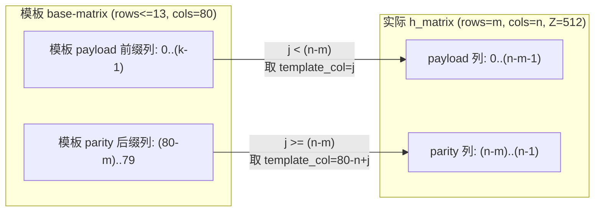
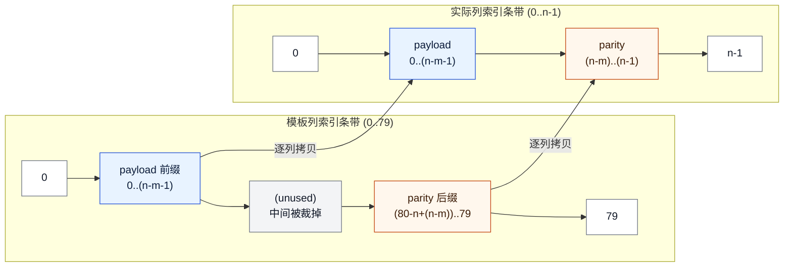
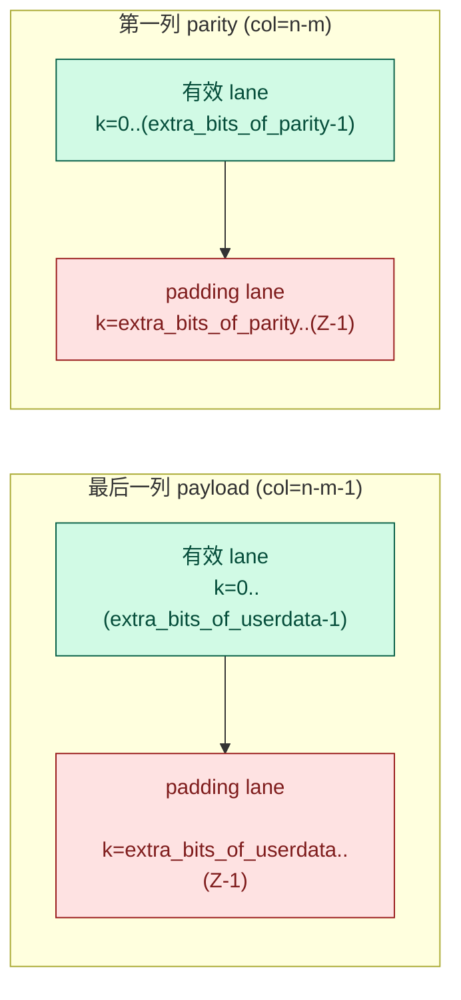
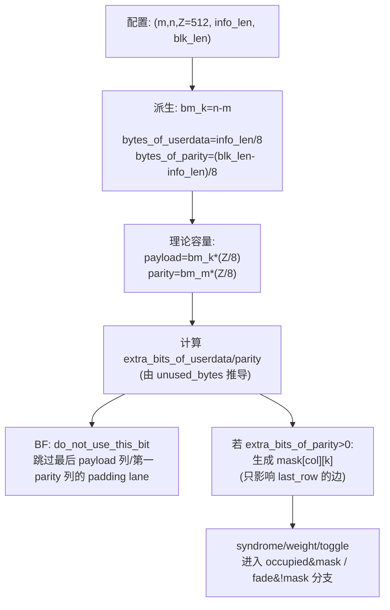
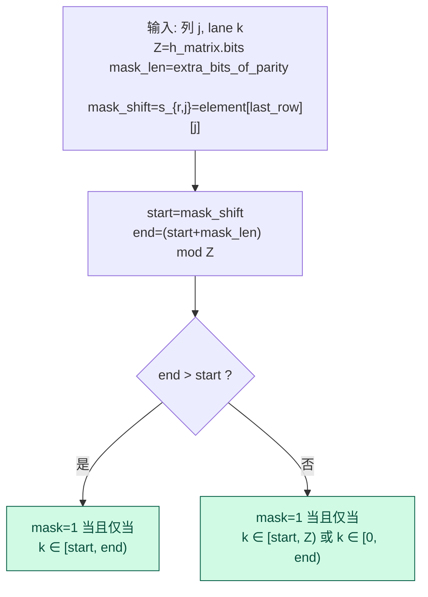
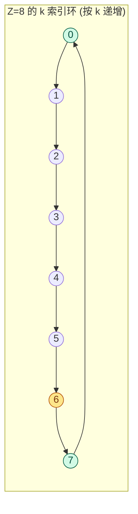
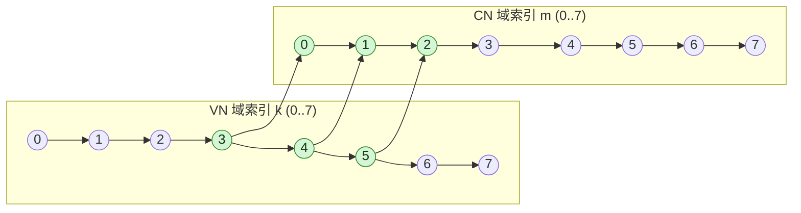
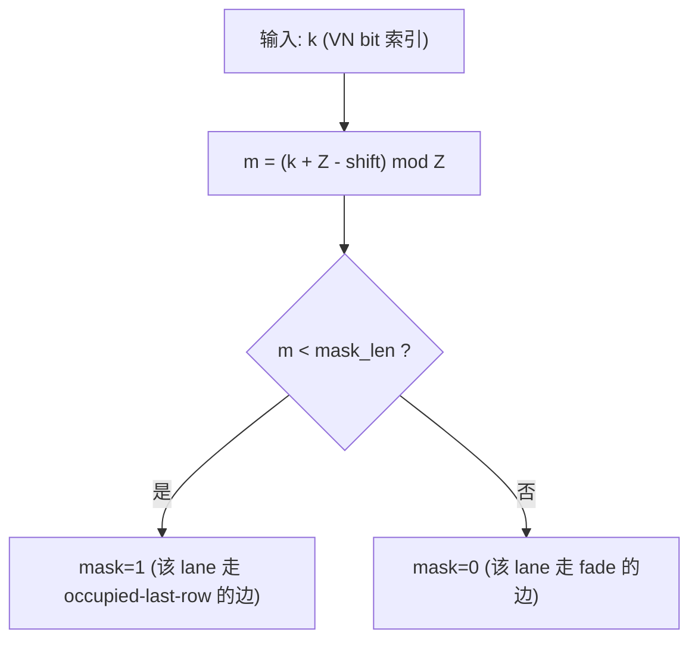

# IBEX 模型中的 `mask` 机制详解（`cir_sz=512`）

本文聚焦 `src/ldpc_codec.cpp` / `src/ldpc_codec.h` 中 `s_h_matrix.mask[80][512]` 的**真实语义**与**生效路径**，用于对照 RTL/硬件实现与排查“尾部非整列 parity”相关问题。

> 结论先行：`mask[j][k]` 不是“跳过某一列尾部若干 bit”的简单开关，而是一个**按列 shift 旋转后的窗口掩码**。它用来表达：当 parity 长度不是 $rows\times Z$ 的整数倍时，最后一行（`row=rows-1`）的 syndrome/校验向量只有前 `extra_bits_of_parity` 个位置有效，其余位置应被“屏蔽/改走 fade”。

---

## 0. `sc=512` 下的矩阵“裁切/短化”模型（为什么会有 `extra_bits_of_*`）

这一节回答一个经常被忽略但会直接影响 RTL/调度理解的问题：**同一套 13×80 的模板如何被裁切成不同 $(m,n,Z)$，以及 payload/parity 在 bit 层面如何被“短化”到实际的 `info_len/blk_len`**。

> 结论先说：在 `sc==512` 路径里，模型不是从外部文件读 $H$，而是生成一套固定的“模板 base-matrix”（列数 80），再按配置的 $(m,n)$ **裁切列**；同时按 `info_len/blk_len` 计算 `extra_bits_of_userdata/extra_bits_of_parity`，在 **最后一列 payload** 与 **第一列 parity** 上做 bit 层面的短化。

### 0.1 三个层次的“长度”

对 QC-LDPC（`Z=sc=512`）来说，存在三个不同层次的长度：

- **base-matrix 尺寸**：`bm_m=m`、`bm_n=n`、`bm_k=n-m`（payload 列数）
- **QC 展开后的理论长度**：
  - $N=bm_n\times Z$（比特）
  - $M=bm_m\times Z$（比特）
  - $K=bm_k\times Z$（比特）
- **实际码字/用户数据长度**：
  - `bytes_of_userdata = info_len/8`
  - `bytes_of_parity = (blk_len-info_len)/8`

当 `bytes_of_userdata` 不是 $bm_k\times(Z/8)$ 的整数对齐，或 `bytes_of_parity` 不是 $bm_m\times(Z/8)$ 的整数对齐时，模型就会引入 `extra_*` 来表达“最后一列只有一部分 lane 有效”。

### 0.2 列级裁切：模板 13×80 → 实际 `h_matrix(rows=m, cols=n)`

`sc==512` 分支会先生成一套列数固定为 80 的模板（`ldpc_matrix_occupied[13][13][80]` / `ldpc_matrix_fade[13][13][80]`），然后把它裁切成 `h_matrix.occupied[m][n]` / `h_matrix.fade[m][n]`：

- **payload 区**（列 `0..(n-m-1)`）：直接取模板的前缀列（`template_col = j`）
- **parity 区**（列 `(n-m)..(n-1)`）：取模板的后缀列（`template_col = 80 - n + j`，等价于 `80-m + (j-(n-m))`）

对应代码：`src/ldpc_codec.cpp:1652-1660`。

用 mermaid 把这个映射关系画出来（只强调“列裁切”的规则）：



再给一个“条带式”的直观示意（把列当成连续区间理解；不画每一列，只画两段区间）：



> 这就是你在比较不同 $N$（同 $M$）的 `rdec_sched` 时经常看到“看似同一行但 shift/shift_delta 不同”的根源之一：模板列被裁切的位置变了，后续的 shift 序列也会跟着变。

### 0.3 bit 级短化：`extra_bits_of_userdata / extra_bits_of_parity`

在 `ldpc_config(..., sc==512)` 里，模型用“理论容量 - 实际字节数”的方式计算：

- `unused_bytes_of_userdata = (bm_k*(Z/8)) - bytes_of_userdata`
- `extra_bytes_of_userdata = (Z/8) - unused_bytes_of_userdata`（若 `unused_bytes_of_userdata==0` 则为 0）
- `extra_bits_of_userdata = extra_bytes_of_userdata*8`

- `unused_bytes_of_parity = (bm_m*(Z/8)) - bytes_of_parity`
- `extra_bytes_of_parity = (Z/8) - unused_bytes_of_parity`（若 `unused_bytes_of_parity==0` 则为 0）
- `extra_bits_of_parity = extra_bytes_of_parity*8`

对应代码：`src/ldpc_codec.cpp:1375-1391`。

这两个 `extra_bits` 在 BF 解码中直接决定“哪些 lane 必须跳过”（即物理上不存在/是 padding）：

- **最后一列 payload**：`col == (n-m-1)` 时，`k >= extra_bits_of_userdata` 的 lane 被 `do_not_use_this_bit` 跳过
- **第一列 parity**：`col == (n-m)` 时，`k >= extra_bits_of_parity` 的 lane 被 `do_not_use_this_bit` 跳过

对应代码：`src/ldpc_codec.cpp:3713-3716`。

同样用“条带式”把 lane 的有效/无效画出来（这里用 `k` 表示列内 bit-lane 索引，范围是 $0..(Z-1)$）：



再用一个流程图把“长度 → extra_bits → 解码跳过/掩码”的关系串起来：



### 0.4 一个具体数值例子（11×76, Z=512）

以你常用的 `m=11,n=76,Z=512` 为例（$bm_k=65$，每列 $Z/8=64$ bytes）：

- payload 理论容量：$65\times64=4160$ bytes
- parity 理论容量：$11\times64=704$ bytes

若实际打印里（示例输出）是 `ECC user data = 4112B`、`ECC parity = 672B`，则：

- `unused_bytes_of_userdata = 4160-4112=48` → `extra_bytes_of_userdata = 64-48=16` → `extra_bits_of_userdata = 128`
- `unused_bytes_of_parity = 704-672=32` → `extra_bytes_of_parity = 64-32=32` → `extra_bits_of_parity = 256`

因此：

- `col=64`（最后 payload 列）只有前 128 个 lane 有效，其余 lane 应跳过
- `col=65`（第一 parity 列）只有前 256 个 lane 有效，其余 lane 应跳过
- 同时，`extra_bits_of_parity=256` 会触发本文件后续章节解释的 `mask`/`fade` 分段机制（否则 last_row 的 syndrome/权重会错位）

---

## 1. 触发条件：什么时候会用到 `mask`

在 `ldpc_config(..., sc==512)` 分支里，代码根据 payload/parity 的字节数是否能整除 $Z/8$（这里 $Z=512$，所以 $Z/8=64$ bytes）计算：

- `unused_bytes_of_parity = rows*(Z/8) - bytes_of_parity`：parity 区相对完整矩阵的“填充字节数”
- `extra_bytes_of_parity = (Z/8) - unused_bytes_of_parity`：第一列 parity 实际有效字节数（也就是“非整列”那部分）
- `extra_bits_of_parity = extra_bytes_of_parity*8`

对应代码位置：`src/ldpc_codec.cpp:1375-1391`。

只有当 `extra_bytes_of_parity > 0`（等价于 `extra_bits_of_parity > 0`）时，后续的 syndrome 计算/权重统计/翻转 toggle 才会进入带 `mask/fade` 的分支；否则直接按传统 QC 全矩阵处理（不看 `mask`）。

---

## 2. `mask[j][k]` 的数学定义（最关键）

记：

- $Z = h_matrix.bits$（通常为 512）
- $r = h_matrix.rows-1$（最后一行）
- 列索引 $j\in[0,cols)$
- VN bit 索引 $k\in[0,Z)$（该列内第 $k$ 个 bit）
- 最后一行该列的移位量 $s_{r,j}=h_matrix.element[r][j]$
- 当 VN bit $(j,k)$ 参与最后一行校验时，对应 CN 索引为 $m = (k + Z - s_{r,j}) \mod Z$。这与 `f_check_nodes` 中的公式一致（见 `src/ldpc_codec.cpp:1128-1144`）。

则 `mask[j][k]` 的定义就是：

- `mask[j][k] = 1` 当且仅当 $m < extra_bits_of_parity$
- 否则 `mask[j][k] = 0`

对应代码（生成处）：`src/ldpc_codec.cpp:1698-1707`。

### 2.1 直观解释：按列 shift 旋转的窗口

由于 $m=(k-s_{r,j})\mod Z$，所以上式等价于：

> `mask[j][k]=1` 选中的是 **长度为 `extra_bits_of_parity` 的连续窗口**，但在 VN 域里被 `s_{r,j}` 旋转到了不同位置。

换句话说，对每个列 $j$，`mask` 并不是简单的 `k<extra_bits`，而是“`k` 落在一个旋转窗口内”。

再补一个“运行时生成 mask 的判定流程”（有助于把 `shift` 与窗口回绕联系起来）：



把上面的“窗口回绕”用一个小的环形索引图再直观一次（示例：$Z=8$、`mask_len=3`、`shift=6`，所以有效 lane 是 $\{6,7,0\}$）：



### 2.2 “旋转”到底是什么意思：两个小例子（用 $Z=8$ 示意）

把 $m$ 看成“校验方程域/行域”里的索引，把 $k$ 看成“列内 VN bit”索引。对于某个固定列 $j$，最后一行的 circulant shift 是 $s$，它把两者的对应关系固定为：

- $m=(k-s)\mod Z$
- 等价地：$k=(m+s)\mod Z$

而 `mask` 的规则是“只让 $m\in[0,mask_len-1]$ 这段有效”。因此在 $k$ 域就表现为把这段窗口整体平移/旋转到从 $k=s$ 开始的位置。

#### 例 1：不跨界（$Z=8$，$s=3$，$mask_len=3$）

有效的 $m$ 是 $\{0,1,2\}$，映射到 $k$：

- $k=(0+3)\mod 8=3$
- $k=(1+3)\mod 8=4$
- $k=(2+3)\mod 8=5$

所以 `mask[k]=1` 的位置是 $\{3,4,5\}$：

```
k:    0 1 2 3 4 5 6 7
mask: 0 0 0 1 1 1 0 0
```

对应的 mermaid 示意（只画出有效映射）：



#### 例 2：跨界（回绕）（$Z=8$，$s=6$，$mask_len=3$）

仍然是有效 $m=\{0,1,2\}$，映射到 $k$：

- $k=(0+6)\mod 8=6$
- $k=(1+6)\mod 8=7$
- $k=(2+6)\mod 8=0$  ← 这里发生了回绕

所以 `mask[k]=1` 的位置是 $\{6,7,0\}$：

```
k:    0 1 2 3 4 5 6 7
mask: 1 0 0 0 0 0 1 1
```

这就是“旋转”的含义：窗口长度不变，但起点从 $0$ 平移到 $s$，必要时会从末端回绕到开头。

### 2.3 用“小 shift=1 的 circulant”再看一遍（$Z=8$）

如果你更习惯把 `element[i][j]` 理解成“circulant 的移位距离/循环距离”，那就从最小的非零距离开始：$s=1$。

仍以最后一行举例，代码中对 VN bit $k$ 计算 CN 索引 $m$ 的公式是 $m=(k+Z-s)\bmod Z$（见 `src/ldpc_codec.cpp:765-766`）。

当 $Z=8$、$s=1$ 时：

- $m=(k-1)\bmod 8$

把每个 $k$ 对应的 $m$ 列出来，你会看到它就是“整体偏移 1 格并回绕”：

```
k:  0 1 2 3 4 5 6 7
m:  7 0 1 2 3 4 5 6
```

现在设 `mask_len=extra_bits_of_parity=3`，规则是 `mask=1` 当且仅当 $m<3$，也就是只允许 $m\in\{0,1,2\}$ 有效。由上表立刻得到：

- $m=0 \Leftarrow k=1$
- $m=1 \Leftarrow k=2$
- $m=2 \Leftarrow k=3$

因此 VN 域的 `mask[k]` 是：

```
k:    0 1 2 3 4 5 6 7
mask: 0 1 1 1 0 0 0 0
```

这就叫“旋转/回绕”：**你在 $m$ 域里固定选中 $m=0..mask_len-1$，经过 circulant shift 映射到 $k$ 域后，选中的 $k$ 会从 $s$ 开始连续 `mask_len` 个位置（必要时回绕到 0）**。

### 2.4 用一个小 circulant 子矩阵可视化 shift（$Z=8, s=3$）

QC-LDPC 里每个非零 base-matrix 元素都对应一个 $Z\times Z$ 的 circulant permutation matrix（循环置换矩阵）。在本实现中，它的连边位置由索引关系确定：

- 对 VN 列内索引 $k$，连到 CN 索引 $m=(k-s)\bmod Z$
- 等价地：矩阵第 $m$ 行在第 $k=(m+s)\bmod Z$ 列处为 1

当 $Z=8, s=3$ 时，这个子矩阵是：

```
      k0 k1 k2 k3 k4 k5 k6 k7
m0:   .  .  .  1  .  .  .  .
m1:   .  .  .  .  1  .  .  .
m2:   .  .  .  .  .  1  .  .
m3:   .  .  .  .  .  .  1  .
m4:   .  .  .  .  .  .  .  1
m5:   1  .  .  .  .  .  .  .
m6:   .  1  .  .  .  .  .  .
m7:   .  .  1  .  .  .  .  .
```

如果 `mask_len=3`，表示只认可 $m0,m1,m2$ 这三行有效，那么从矩阵直接读出：

- $m0,m1,m2$ 只依赖 $k3,k4,k5$
- 所以 `mask[k]=1` 的位置就是 $\{3,4,5\}$（这与“例 1”的结果一致）

#### $Z=8$ 下“所有 shift”的 circulant 子矩阵示意（$s=0..7$）

为了把“旋转”理解彻底，下面把 $Z=8$ 时所有可能的 shift 都列出来。你会看到每增加 1 的 shift，矩阵中的那条“1 的对角线”就整体向右移动 1 格，并在末端回绕到开头。

> 记住一条就够：第 $m$ 行的 1 总在第 $k=(m+s)\bmod Z$ 列。

```
s=0
      k0 k1 k2 k3 k4 k5 k6 k7
m0:   1  .  .  .  .  .  .  .
m1:   .  1  .  .  .  .  .  .
m2:   .  .  1  .  .  .  .  .
m3:   .  .  .  1  .  .  .  .
m4:   .  .  .  .  1  .  .  .
m5:   .  .  .  .  .  1  .  .
m6:   .  .  .  .  .  .  1  .
m7:   .  .  .  .  .  .  .  1

s=1
      k0 k1 k2 k3 k4 k5 k6 k7
m0:   .  1  .  .  .  .  .  .
m1:   .  .  1  .  .  .  .  .
m2:   .  .  .  1  .  .  .  .
m3:   .  .  .  .  1  .  .  .
m4:   .  .  .  .  .  1  .  .
m5:   .  .  .  .  .  .  1  .
m6:   .  .  .  .  .  .  .  1
m7:   1  .  .  .  .  .  .  .

s=2
      k0 k1 k2 k3 k4 k5 k6 k7
m0:   .  .  1  .  .  .  .  .
m1:   .  .  .  1  .  .  .  .
m2:   .  .  .  .  1  .  .  .
m3:   .  .  .  .  .  1  .  .
m4:   .  .  .  .  .  .  1  .
m5:   .  .  .  .  .  .  .  1
m6:   1  .  .  .  .  .  .  .
m7:   .  1  .  .  .  .  .  .

s=3
      k0 k1 k2 k3 k4 k5 k6 k7
m0:   .  .  .  1  .  .  .  .
m1:   .  .  .  .  1  .  .  .
m2:   .  .  .  .  .  1  .  .
m3:   .  .  .  .  .  .  1  .
m4:   .  .  .  .  .  .  .  1
m5:   1  .  .  .  .  .  .  .
m6:   .  1  .  .  .  .  .  .
m7:   .  .  1  .  .  .  .  .

s=4
      k0 k1 k2 k3 k4 k5 k6 k7
m0:   .  .  .  .  1  .  .  .
m1:   .  .  .  .  .  1  .  .
m2:   .  .  .  .  .  .  1  .
m3:   .  .  .  .  .  .  .  1
m4:   1  .  .  .  .  .  .  .
m5:   .  1  .  .  .  .  .  .
m6:   .  .  1  .  .  .  .  .
m7:   .  .  .  1  .  .  .  .

s=5
      k0 k1 k2 k3 k4 k5 k6 k7
m0:   .  .  .  .  .  1  .  .
m1:   .  .  .  .  .  .  1  .
m2:   .  .  .  .  .  .  .  1
m3:   1  .  .  .  .  .  .  .
m4:   .  1  .  .  .  .  .  .
m5:   .  .  1  .  .  .  .  .
m6:   .  .  .  1  .  .  .  .
m7:   .  .  .  .  1  .  .  .

s=6
      k0 k1 k2 k3 k4 k5 k6 k7
m0:   .  .  .  .  .  .  1  .
m1:   .  .  .  .  .  .  .  1
m2:   1  .  .  .  .  .  .  .
m3:   .  1  .  .  .  .  .  .
m4:   .  .  1  .  .  .  .  .
m5:   .  .  .  1  .  .  .  .
m6:   .  .  .  .  1  .  .  .
m7:   .  .  .  .  .  1  .  .

s=7
      k0 k1 k2 k3 k4 k5 k6 k7
m0:   .  .  .  .  .  .  .  1
m1:   1  .  .  .  .  .  .  .
m2:   .  1  .  .  .  .  .  .
m3:   .  .  1  .  .  .  .  .
m4:   .  .  .  1  .  .  .  .
m5:   .  .  .  .  1  .  .  .
m6:   .  .  .  .  .  1  .  .
m7:   .  .  .  .  .  .  1  .
```

补充：若固定 `mask_len=3`，那么对任意 shift $s$，`mask[k]=1` 的 $k$ 集合恒等于 $\{s,(s+1)\bmod 8,(s+2)\bmod 8\}$，因此会出现 $s=6/7$ 这类“跨界回绕”的情况：

| shift $s$ | `mask[k]=1` 的 $k$ |
|---:|:---|
| 0 | {0,1,2} |
| 1 | {1,2,3} |
| 2 | {2,3,4} |
| 3 | {3,4,5} |
| 4 | {4,5,6} |
| 5 | {5,6,7} |
| 6 | {6,7,0} |
| 7 | {7,0,1} |

---

## 2.x 术语与概念澄清：`mask_shift` / `fade` / “last row circulant” / “first parity circulant”

这一节回答两个最常见的疑问：`mask_shift` 是什么、`fade` 是什么，以及“last row circulant / first parity circulant”在本工程里各指什么。

### 2.x.1 什么是 `mask_shift`

在本文前面的公式里，最后一行某列的 shift 记为 $s_{r,j}=h\_matrix.element[r][j]$。为了硬件实现方便，经常把它单独拿出来叫 **`mask_shift[j]`**：

- `mask_shift[j] := element[rows-1][j]`

它的作用只有一个：**把 CN 域里固定的“有效窗口”搬运（旋转）到 VN 域对应的位置**。

如果你用“窗口起点”描述，那么对于列 $j$：

- 有效窗口长度：`mask_len := extra_bits_of_parity`
- 有效窗口在 VN 索引 $k$ 上的起点：`start_k := mask_shift[j]`（回绕比较见第 8 节）

因此硬件常用实现是：

- `mask(col=j, k) = is_in_cyclic_interval(k, start_k, mask_len)`

它与软件实现 `m=(k+Z-shift)%Z; mask=(m<mask_len)` 是完全等价的（第 8 节给了无取模的区间比较写法）。

### 2.x.2 如何理解 `fade` 与 “fade circulant”

`fade[i][j]` 是 `s_h_matrix` 里和 `occupied[i][j]` 并列的一个标志（见 `src/ldpc_codec.h:57-58`）。你可以把它理解成：

- `occupied[i][j]==1`：该 base-matrix 位置的 circulant 在**常规情况下**是有效连边（整段 $Z$ lane 都有效）。
- `fade[i][j]==1`：该位置的 circulant 在“**partial parity（`extra_bytes_of_parity>0`）**”场景下，用来覆盖 `mask==0` 的那一段 lane，也就是 **只在 `!mask` 区域生效**（可类比 RTL 的 `~mask`）。

这一点在 `f_check_nodes()` 的分支逻辑里体现得最直接（`src/ldpc_codec.cpp:770-777`）：

- last-row occupied：`occupied && (row==rows-1) && mask` 才 toggle
- fade：`fade && !mask` 才 toggle

因此所谓 **fade circulant**，就是指 base-matrix 中某个位置 `(i,j)` 满足 `fade[i][j]==1` 的那块 circulant 子矩阵，它不是“整块有效”，而是“只在 `!mask` 的 lane 有效”。

补充：`fade` 的来源是矩阵生成过程里为了满足行权重/约束，把某些原本 `occupied` 的位置“摘掉”并标记为 `fade`（见 `src/ldpc_codec.cpp:1224-1238`）。在本工程中，只有在 `extra_bytes_of_parity>0` 进入 partial-parity 分支时，这些 `fade` 才会被真正纳入边集合；否则 IBEX BF 的权重统计分支并不会把 `fade` 算进去。

### 2.x.3 什么是 “last row circulant”

在 QC base-matrix 里，“row”对应一组 $Z$ 个 CN（校验方程实例），因此：

- **last row** 指 $i = rows-1$
- **last row circulant** 指 base-matrix 最后一行上某个非零位置 `(rows-1, j)` 对应的 $Z\times Z$ circulant 子矩阵（在本工程里通常通过 `occupied[rows-1][j]` 判定它存在）

last row 之所以特殊，是因为当 `extra_bytes_of_parity>0` 时，只有 last row 的 `occupied` 会被 `mask` 分段（`mask`/`!mask`），见 `src/ldpc_codec.cpp:773-775` 与 BF toggle 分支 `src/ldpc_codec.cpp:3419-3422`。

### 2.x.4 什么是 “first parity circulant”

本工程的列索引习惯是：最后 `rows` 列是 parity 列，其中第一列 parity 的列号是：

- `first_parity_col := cols - rows`

在 BF 解码中用它判断哪些 parity bit 是 padding（`src/ldpc_codec.cpp:3316-3317`），在输入映射中也用它填充 unused parity bits（`src/ldpc_codec.cpp:1372-1381`）。

因此 **first parity circulant** 一般指：

- base-matrix 位置 `(rows-1, first_parity_col)` 的那块 circulant（它把 last row 的 CN 向量映射到这列 parity bit）

当 parity 大小不是 $rows\times Z$ 的整倍时，正是这一列出现“部分有效 bit”，从而触发 `extra_bytes_of_parity/extra_bits_of_parity` 与 `mask` 机制。

---

## 2.y 如何理解外部文档片段（$P=5$，shift=2，unused=2，mask=11100）

外部描述：

- “length of unused bits is $P-(parity\ size)\%P$”
- “If $P=5$, shift value is 2, unused bits is 2, the mask corresponding the first parity circulant is 11100”

把它翻译成本文符号：

1) $P$ 对应 circulant 大小（也就是 $Z$ 的缩小版示例）。
2) `unused_bits = P - (parity_size mod P)` 表示该 parity 列只用了 `parity_size mod P` 个 bit，其余 `unused_bits` 个 bit 是 padding。
3) 因此有效窗口长度是 $mask\_len = P - unused\_bits$。当 $P=5$、`unused_bits=2` 时，$mask\_len=3$。
4) shift=2（本文记作 $s=2$）。在本工程的索引关系下（见第 2 节），有效的 CN 索引是 $m\in\{0,1,2\}$，映射到 VN 索引：
   - $k=(m+s)\bmod P \Rightarrow k\in\{2,3,4\}$
5) 因此如果你按 $k=0..4$ 的顺序写 mask，会得到 `00111`（k2,k3,k4 为 1）。

那为什么文档写的是 `11100`？最常见原因是 **位向量的书写顺序是 `[P-1:0]`（从高位到低位）**：

- `00111`（k0..k4）反向写成 `11100`（k4..k0）

这与很多 RTL/文档用 `[P-1:0]` 表示向量是一致的，所以两者本质上描述的是同一个 mask。

### 2.5 算法实现视角：mask 计算流程图



---

## 3. `mask` 是怎么生成的（源码链路）

在 `ldpc_config(sc==512)` 中：

1) 先把整个 `mask[j][k]` 清零（`src/ldpc_codec.cpp:1327-1329`）

2) 如果 `extra_bits_of_parity > 0`，只对满足 **最后一行该列为 occupied** 的列生成 mask：

```cpp
if (h_matrix.extra_bits_of_parity > 0) {
  for (j = 0; j < h_matrix.cols; j++) {
    if (h_matrix.occupied[h_matrix.rows - 1][j]) {
      for (k = 0; k < h_matrix.bits; k++) {
        bit = (k + h_matrix.bits - h_matrix.element[h_matrix.rows - 1][j]) % h_matrix.bits;
        if (bit < h_matrix.extra_bits_of_parity)
          h_matrix.mask[j][k] = 1;
      }
    }
  }
}
```

（见 `src/ldpc_codec.cpp:1331-1339`）

为什么只依赖“最后一行”？因为在这个 IBEX 结构里，第一列 parity（列索引 `j==cols-rows`）直接来自最后一行 check-node 向量（编码时 `m=rows-1`，见 `src/ldpc_codec.cpp:1956-1960`）。当 parity 是“非整列”时，本质上是 **最后一行的 syndrome 向量只有前 `extra_bits_of_parity` 个位置需要对应真实 parity bit**。

---

## 4. `mask` 与 `occupied/fade` 的组合规则（软件=RTL 的核心）

当 `extra_bytes_of_parity == 0`：所有逻辑都走简单分支，只认 `occupied[i][j]`（`fade/mask` 不参与）。

当 `extra_bytes_of_parity > 0`：同一块 circulant 会被“按 bit 位置拆分成两部分”：

- **occupied 且在最后一行**：只对 `mask==1` 的 VN bit 生效  
- **fade**：只对 `mask==0` 的 VN bit 生效（即 `!mask==1` 的部分）
- **occupied 且非最后一行**：整块照常生效（不看 mask）

这一点在 `f_check_nodes()` 的更新分支里写得最清楚（`src/ldpc_codec.cpp:766-777`）：

```cpp
if (h_matrix.occupied[i][j] && (i < h_matrix.rows - 1))
  cn.r[i].b[m] = !cn.r[i].b[m];
if (h_matrix.occupied[i][j] && (i == h_matrix.rows - 1) && h_matrix.mask[j][k])
  cn.r[i].b[m] = !cn.r[i].b[m];
if (h_matrix.fade[i][j] && !h_matrix.mask[j][k])
  cn.r[i].b[m] = !cn.r[i].b[m];
```

这与 `doc/ibex.md` 中 RTL 伪码 `mask_for_row = mask_row?mask : fade_row?~mask : ...` 的思想一致：**一部分用 mask，另一部分用反 mask**。

---

## 5. 在编码路径中的作用（为什么不做会出错）

编码相关路径里，`mask` 参与了 syndrome 的计算与更新：

- 初始 syndrome 由 `f_check_nodes()` 计算（`src/ldpc_codec.cpp:751-783`），其内部按上面的 `occupied/fade/mask` 规则决定每条边是否存在。
- `f_ldpc_encode()` 在把 parity 写入 VN 后，会“增量更新 CN”（`src/ldpc_codec.cpp:1965-1981`），这段更新同样用 `mask/fade` 分支。

因此，如果硬件/RTL 在“非整列 parity”场景下没有实现同样的 `mask` 规则，会出现两类典型问题：

1) **编码侧 syndrome 不为 0**（软件里有强校验：`src/ldpc_codec.cpp:2005-2011`）
2) **译码侧 syndrome_weight 无法正确下降**（因为 CN 的定义与真实码字结构不一致）

---

## 6. 在 IBEX BF 解码中的作用（权重统计与 syndrome toggle）

### 6.1 跳过“物理上不存在”的 VN bit（与 mask 不同）

BF 主循环里还有一层更“物理”的跳过逻辑：对于**非整列**的 payload/parity，直接不更新某些 VN bit（`do_not_use_this_bit`）：

- 第一列 parity：`j == cols-rows` 且 `k >= extra_bits_of_parity`
- 最后一列 payload：`j == cols-rows-1` 且 `k >= extra_bits_of_userdata`

见 `src/ldpc_codec.cpp:3316-3319`。

这一步的语义是：这些 bit 在码字中根本不存在/被视为 padding，任何翻转都会破坏码字映射，因此直接禁止参与迭代。

### 6.2 权重 `weight` 的统计要遵守 mask

IBEX BF 的 `weight` 统计在 `extra_bytes_of_parity>0` 时会用 `occupied(last row)&mask`、`fade&!mask` 计数（见 `src/ldpc_codec.cpp:3330-3335`），否则会把不该存在的边也算进去，导致：

- 错误比特“推不动/推过头”的概率上升
- syndrome_weight 统计偏离真实约束，出现假 error-floor

### 6.3 翻转时对 syndrome 的增量更新也要遵守 mask

当某 bit 的 `flipped` 状态改变，需要对其关联的所有 CN 位做 toggle。该 toggle 同样有 `mask/fade` 分支（见 `src/ldpc_codec.cpp:3413-3423`），否则 CN 会被错误地翻动，导致后续 `weight` 失真并快速发散。

---

## 7. Layer/Retry decoder（512 变体）里的 mask 用法（如果你要做 rdec 硬件）

仓库中存在 `ldpc_dec_layer2()`（`src/ldpc_codec.cpp:2689` 起）这一套对 `extra_bytes_of_parity` 做特殊处理的 Layer 译码逻辑，它在计算 APP、累积 syndrome、更新 Q/R/C 消息时多处引用 `h_matrix.mask`（例如 `src/ldpc_codec.cpp:2816-2826`、`2864-2876`、`2886-2899`、`2912-2925`）。

如果你计划把 rdec 调度（`rdec_sched`）用于硬件，那么**mask 的实现不是可选项**：它决定某些 circulant 在某些 lane 上应被视为“无效边”（不参与 APP/R 更新或以零/无穷大处理）。

---

## 8. 硬件实现建议：不存 80×512 mask，本地计算/压缩即可

由于 `mask[j][k]` 对每一列 $j$ 只是一个“旋转窗口”，硬件实现可压缩为：

- 全局：`mask_len = extra_bits_of_parity`（0..512）
- 对每列：`mask_shift[j] = element[rows-1][j]`（仅当最后一行该列为 occupied 时需要）

运行时对 lane $k$ 生成：

1) 计算 $m=(k+Z-mask_shift[j])\mod Z$
2) `mask = (m < mask_len)`

或做等价的“区间比较”实现（无需取模器）：令 `start=mask_shift[j]`，`end=(start+mask_len)%Z`：

- 若 `end > start`：`mask = (k >= start) && (k < end)`
- 若 `end <= start`：`mask = (k >= start) || (k < end)`

然后对每个 base-matrix 位置 `(row,col)` 决定 lane 使能：

- 若 `occupied[row][col] && row == rows-1`：`lane_en = mask`
- 若 `fade[row][col]`：`lane_en = !mask`
- 其它 `occupied`：`lane_en = 1`
- 其它：`lane_en = 0`

### 8.1 `rdec_sched` 导出格式（含 mask 信息 + extra-userdata 占位）

当前仓库的 `print_hm()`（`src/ldpc_codec.cpp`）对 `cir_sz=512` 的 `rdec_sched` 导出为“Verilog ROM case 语句”风格，每行一条：

`10'dADDR     :mmem_rdt=42'hXXXXXXXXXXX;`

其中 `XXXXXXXXXXX` 是 11 个 hex；实际有效位为低 42bit，高 2 个显示 bit 恒为 0。当导出“extra user-data 列”的 **0-circulant 占位**时，会直接输出 `42'hFFFFFFFFFFF`（低 42bit 全 1）作为占位标志。

- `sched64`：调度本体（低 32bit 复用旧字段，同时携带 mask 相关最小信息）
  - `[6:0] col`（7bit）
  - `[15:7] shift`（9bit）
  - `[20:16] pre_cir_row`（5bit）：同一列前驱 circulant 的 row
  - `[29:21] shift_delta`（9bit）：$(shift - pre\_shift)\bmod Z$
  - `[30] last_in_row`（1bit）
  - `[31] flag_64_extra_userdata`（1bit）：当该条目位于“extra user-data payload 列”时为 1；定义为 `col ∈ [64, (n-m))`（payload 列超过 64 时生效）。例如 11x76（payload 列数 $n-m=65$）只有 `col=64` 属于该范围。
  - `[32] mask_flag`（1bit）：该 circulant 需要做 lane mask（MASK 或 INVMASK）
  - `[41:33] delta_to_last`（9bit）：无符号模 $Z$ 差值，定义为 $(last\_row\_shift-entry\_shift+Z)\bmod Z$

这样做的好处是：调度文件只携带矩阵静态信息。运行时只要知道当前 `L=pad_bit` 和当前 row 是否为 `last_row`，就能直接恢复本地窗口：

- `mask_flag=1` 且 `row==last_row`：`start_local=0`，`len=L`
- `mask_flag=1` 且 `row!=last_row`：`start_local=(delta_to_last+L)\bmod Z`，`len=Z-L`

> 仍需强调：软件里 `mask[col][k]` 的生成仍然使用 `element[rows-1][col]`（见 `src/ldpc_codec.cpp:1671-1680`），不是当前条目的 `shift`。`rdec_sched` 这里只是把该绝对位移重新编码成了 `delta_to_last=(last_row_shift-entry_shift+Z)\bmod Z`，便于 DV/RTL 侧按当前 `L` 直接恢复每个 entry 的本地窗口。

---

## 9. 常见误区与自检点

1) **只做 `do_not_use_this_bit` 但不做 `mask`**：不够。`do_not_use` 只屏蔽“物理不存在的 VN bit”，而 `mask` 还在定义“最后一行哪些 CN 位置存在”。
2) **把 `mask` 当成固定 `k<extra_bits`**：不对。必须按列 shift 旋转，否则不同列的 CN 对齐会错。
3) **`extra_bytes_of_parity==0` 时还强行用 mask 分支**：会导致 `mask` 全 0、`fade&!mask` 全开等异常行为。软件用 `if (extra_bytes_of_parity==0) ... else ...` 明确隔离。
