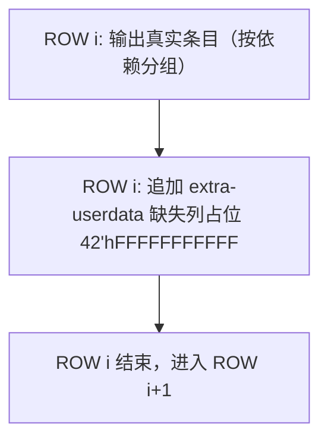
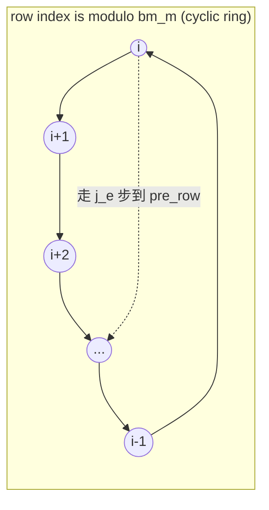
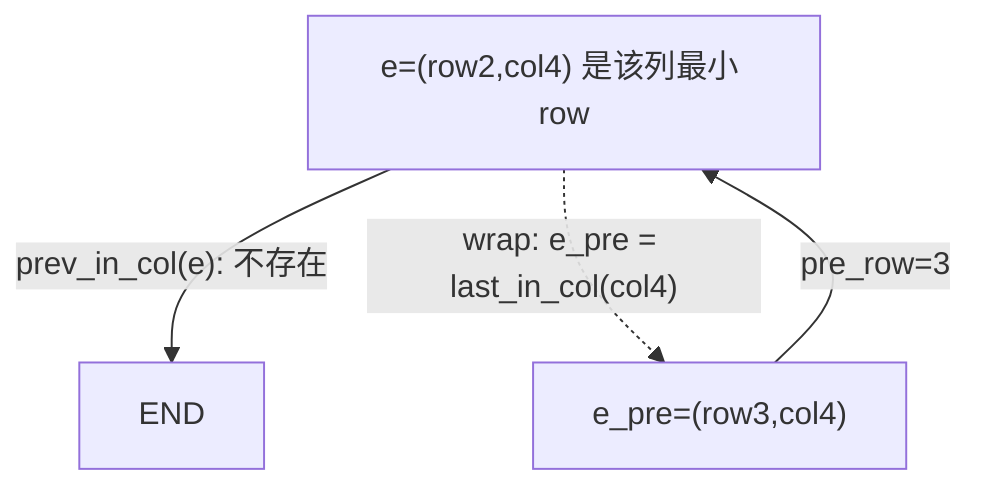
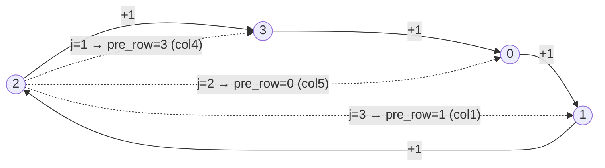
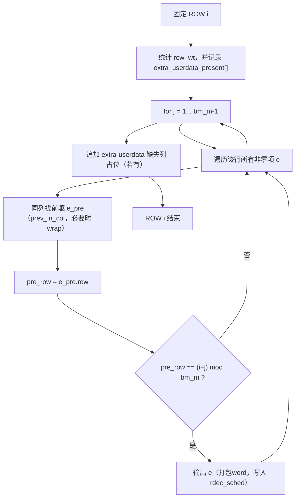
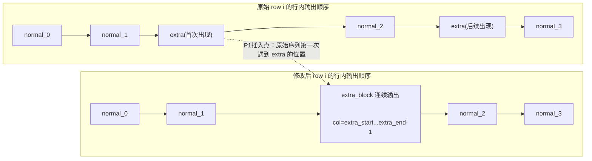
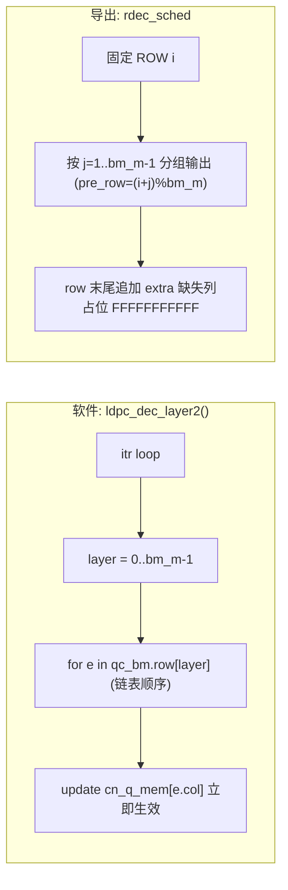

# IBEX `rdec_sched`：导出格式、字段含义与输出顺序（复盘）

本文档复盘 IBEX 工程中 `rdec_sched`（layer decoder scheduler）的：

- 文件格式与字段解码方式
- `flag_64_extra_userdata` 与 extra user-data payload 列的定义
- `42'hFFFFFFFFFFF` 占位哨兵（zero-circulant placeholder）的生成原因与解析注意事项
- 输出顺序（为何不是按 `col` 排序、为何会出现占位插入）
- 以 `10x76ex512_w4` 为例的可验证证据

> 约定  
> - 以 `IBEX/src/ldpc_codec.cpp` 的当前实现为准。  
> - $bm_m$：base-matrix 行数（layer 数）；$bm_n$：base-matrix 列数；$Z$：circulant size（此处重点为 $Z=512$）。  
> - “row / layer”指 base-matrix 的行；“col”指 base-matrix 的列。  

---

## 0. 产物文件与基本格式

`rdec_sched` 导出文件名（由代码拼接）：

- `./output/rdec_sched_%dx%dex%d_w%d.txt`（依次为 $bm_m,bm_n,Z,col\_wt$）

文件每行对应一条 ROM case 形式：

```
10'dADDR     :mmem_rdt=42'hXXXXXXXXXXX;
```

- `ADDR`：调度条目地址（自增）
- `XXXXXXXXXXX`：11 个 hex 字符；实际有效位为低 42 bit

> 重要：`42'hFFFFFFFFFFF`（低 42 bit 全 1）在本实现中被用作占位哨兵，不是正常条目。

---

## 1. 42-bit 字段定义与解码

IBEX 当前将调度信息打包为 42 bit，并按 11 个 hex 字符打印；最高显示出来的 2 个 bit 恒为 0。

字段分布（见 `IBEX/src/ldpc_codec.cpp` 中 RDEC scheduler packing）：

- `[6:0]` `col`（7 bit）：列号
- `[15:7]` `shift`（9 bit）：本 circulant 的 shift（$0..Z-1$）
- `[20:16]` `pre_cir_row`（5 bit）：同列前驱 circulant 的行号
- `[29:21]` `shift_delta`（9 bit）：$(shift - pre\_shift)\bmod Z$
- `[30]` `last_in_row`（1 bit）：行内结束标志（注意：当前实现是“提前 1 cycle”，详见第 5 节）
- `[31]` `flag_64_extra_userdata`（1 bit）：是否位于 extra user-data payload 列
- `[32]` `mask_flag`（1 bit）：是否需要 lane mask（MASK/INVMASK）
- `[41:33]` `delta_to_last`（9 bit）：无符号模 $Z$ 差值，定义为 $(last\_row\_shift - shift + Z)\bmod Z$

建议的解码公式（`uint64_t word`）：

- $col = word\ \&\ 0x7F$
- $shift = (word >> 7)\ \&\ 0x1FF$
- $pre\_row = (word >> 16)\ \&\ 0x1F$
- $shift\_delta = (word >> 21)\ \&\ 0x1FF$
- $last = (word >> 30)\ \&\ 1$
- $flag\_{64} = (word >> 31)\ \&\ 1$
- $mask\_flag = (word >> 32)\ \&\ 1$
- $delta\_to\_last = (word >> 33)\ \&\ 0x1FF$

> `delta_to_last` 只有在 `mask_flag==1` 时才有意义。它表示“从当前 entry 的 shift 走到同列 last-row shift 的模 $Z$ 差值”，不是绝对 `mask_shift`。因此：
> - last-row occupied 条目应满足 `delta_to_last==0`
> - fade 条目应满足 `delta_to_last=(last_row_shift-fade_shift+Z)%Z`
> - 不需要 `mask_role`，因为 DV 侧可用当前 row 是否为 `last_row` 来区分 `last_row` 与 `fade`

---

## 2. extra user-data payload 列：为何从 `col=64` 开始

当 $Z=512$ 时，每个 payload column 承载 $Z/8=64$ 字节。于是：

- 前 64 个 payload 列恰好覆盖 $64\times 64 = 4096$ 字节
- 若 payload 列总数 $payload\_cols\_total = bm_n - bm_m$ 超过 64，则会出现“extra payload 列”

IBEX 里对 $Z=512$ 固定定义：

- `base_userdata_cols = 64`
- `payload_cols_total = bm_n - bm_m`
- extra user-data payload 列区间：$col \in [64,\ payload\_cols\_total)$

因此：

- 若 $payload\_cols\_total \le 64$，则不存在 extra user-data 列，`flag_64_extra_userdata` 恒为 0
- 若 $payload\_cols\_total > 64$，则 `col=64..payload_cols_total-1` 属于 extra user-data 区间

例：`10x76`  
$bm_m=10,bm_n=76 \Rightarrow payload\_cols\_total=66$，extra user-data 列为 `col=64,65` 两列。

---

## 3. `42'hFFFFFFFFFFF`：zero-circulant 占位哨兵（为什么会出现全 F）

### 3.1 设计目的

IBEX 的导出策略是：对每一行（layer），对每一个 extra user-data payload 列都“保证输出一条记录”，即使该列在该行是 0-circulant（基矩阵为 0 / 不存在 CPM）。

当该行该列缺失非零 CPM 时，会输出占位哨兵：

- `42'hFFFFFFFFFFF`（低 42 bit 全 1）

这使得硬件或后处理脚本可以按固定节拍消费 extra 列条目，而不需要再去查询 base-matrix 是否存在该 circulant。

### 3.2 占位哨兵的副作用（为什么会误判 flag/last）

因为占位哨兵是“全 1”，如果你把它当作正常条目解码，会得到：

- `col=127`、`flag_64_extra_userdata=1`、`last_in_row=1` 等

这些全部都只是“哨兵的副作用”，不能用来判断真实语义。正确做法是解析前先过滤 `word==0xFFFFFFFFFFF`。

### 3.3 占位哨兵在输出流中的位置

占位哨兵并不是在主调度循环里输出，而是在该 row 的真实条目全部输出后追加，因此它总出现在 row 的末尾（并且若缺多个 extra 列，占位会连续）。



---

## 4. 输出顺序总览：为何不是按 `col` 排序

### 4.1 两个核心概念：`pre_row` 与“循环偏移” $j_e$

对固定 row（layer）`i`，考虑该行中的某个非零项 `e`（一个 circulant）：

1) 在“同一列”中找 `e` 的前驱 circulant（`prev_in_col`，若到头则 wrap 到 `last_in_col`），记为 `e_pre`  
2) 定义 `pre_row = e_pre->row`

于是存在唯一的 $j_e\in\{1,2,\dots,bm_m-1\}$ 使得：

- $pre\_row = (i + j_e)\bmod bm_m$

等价写法：

- $j_e = (pre\_row - i + bm_m)\bmod bm_m$

这就是我们口头称的“行距/偏移”：从行号 $i$ 沿着 “+1 并对 $bm_m$ 取模”的方向，走 $j_e$ 步会走到 `pre_row`。

用 mermaid 画成“行号环”，会更直观：



> 直觉：$j_e$ 越大，表示 `pre_row` 离当前行 $i$ 在环上“更靠后”；$j_e=bm_m-1$ 对应 `pre_row=i-1`（上一行）。

### 4.2 生成顺序：按 $j=1..bm_m-1$ 分组输出

代码的核心结构是：

- 对固定 row `i`：
  - `for (j=1; j<bm_m; j++)`：
    - 再遍历该行所有非零 `e`
    - 仅当 `pre_row == (i+j)%bm_m` 时输出 `e`

这等价于：把该行所有 `e` 按其 $j_e$ 分桶，然后按 $j=1,2,\dots,bm_m-1$ 的顺序把桶依次倒出。  
因此 row 内主排序键是 $j_e$（由 `pre_row` 决定），不是 `col`。

#### 4.2.1 小矩阵手算例子（$bm_m=4,bm_n=6$）

为把 $j_e$ 的含义“落到可手算的具体数值”，下面构造一个 $4\times 6$ 的 toy base-matrix，只关心非零位置（`1` 表示存在非零 circulant，`.` 表示 0-circulant）：

```
       c0 c1 c2 c3 c4 c5
r0      .  .  .  .  .  1
r1      .  1  .  .  .  .
r2      .  1  .  .  1  1
r3      .  .  .  .  1  .
```

也就是非零集合：

- row0：col5
- row1：col1
- row2：col1、col4、col5（注意：`mod2sparse_first_in_row/next_in_row` 会按 `col` 升序遍历：`1→4→5`）
- row3：col4

我们只看 layer `i=2`（row2）这一行在 `rdec_sched` 中的输出顺序。

**(1) 先确定每个 `e` 的 `pre_row`（同列前驱）**

按 `IBEX/src/ldpc_codec.cpp`：

- `e_pre = mod2sparse_prev_in_col(e)`：同列里 row 更小的那条；若不存在（`e` 是该列最小 row），则 wrap：`e_pre = mod2sparse_last_in_col(qc_bm, e->col)`。

因此对 row2 的三个非零 `e`：

- `e=(row2,col1)`：col1 的非零行集合是 `{row1,row2}`，所以 `pre_row=row1=1`
- `e=(row2,col4)`：col4 的非零行集合是 `{row2,row3}`，而 row2 是该列最小 row，所以 `prev_in_col` 不存在，wrap 到 `last_in_col=row3`，因此 `pre_row=3`
- `e=(row2,col5)`：col5 的非零行集合是 `{row0,row2}`，所以 `pre_row=row0=0`

下面用一张图专门说明“最小 row 需要 wrap”的情况（以 `col4` 为例）：



**(2) 计算 $j_e$ 并得到 row2 的输出顺序**

对固定 `i=2`，该 `e` 被输出的条件是：

- $pre\_row = (i+j)\bmod bm_m$

因此 $j_e$ 是唯一满足上式的 $j$：

- $j_e = (pre\_row - i + bm_m)\bmod bm_m$，且 $j_e\in\{1,2,3\}$（不能是 0）

代入上面求得的 `pre_row`：

| `e` | `pre_row` | $j_e=(pre\_row-2)\bmod 4$ | 将在外层哪个 `j` 被输出 |
|---|---:|---:|---|
| (row2,col4) | 3 | 1 | `j=1` |
| (row2,col5) | 0 | 2 | `j=2` |
| (row2,col1) | 1 | 3 | `j=3` |

所以：row2 的输出顺序是 `j=1` 组先输出 `col4`，再 `j=2` 组输出 `col5`，最后 `j=3` 组输出 `col1`。

用“row 索引环”可以直观看到 $j_e$ 就是“沿 +1 方向走的步数”（此处 $bm_m=4$）：



> 结论（对“是否有方向性”的回答）  
> - row 内不是按 `col` 单调排序；例如本例输出 `col4→col5→col1`（`col` 会“回绕”）。  
> - 但它是确定性的“二级排序”：**先按 `j=1..bm_m-1`（也就是按 `pre_row` 沿 row 环的 +1 方向距离）分组输出；同一 `j` 组内，因为遍历 row 的 `e` 是按 `col` 升序扫描，因此组内顺序是 `col` 升序。**

下面的流程图与代码一一对应：



### 4.3 “为什么要这样设计”（动机与风险提示）

从软件层面看，按 $j_e$ 分组输出至少有两个直接后果：

1) 对同一列（同一 `col`）的相邻访问间隔会被拉开或重排，从而影响“刚写后读/端口冲突”等硬件风险。
2) 输出序列会影响约束检查：代码导出后会检查 C-MEM/HD-MEM 约束（例如同一 `col` 在窗口内不得重复出现）。

在没有完整 RTL 解释文档的情况下，我们不能把动机“绝对化”，但至少可以确认：当前实现的输出顺序与约束检查是绑定的，因此改序需要谨慎评估。

---

## 5. `last_in_row`：为何你会觉得“一行出现两个 1”

当前实现对 `last_in_row` 的注释是 *1 cycle in advance*，其置位条件是：

- 在该 row 的真实条目序列中，当 `tmp == row_wt - 1` 时置 `last_in_row=1`

这意味着：若该 row 有 `row_wt` 个真实条目，则 `last_in_row=1` 出现在倒数第二个真实条目上，而不是最后一个。

如果你在解析时把它当成“最后一个条目”，就会出现边界错位的现象。  
此外，若你没有过滤 `FFFFFFFFFFF` 占位哨兵，占位词的 bit[30] 也为 1，会进一步造成“一行出现两个 1”的错觉。

建议的自检顺序：

1) 先过滤 `word==0xFFFFFFFFFFF`
2) 再按“倒数第二条置 1”的语义解析 `last_in_row`

---

## 6. `10x76ex512_w4`：用具体证据解释 “addr=33 为全 F”

### 6.1 extra-userdata 列数量

对 `10x76ex512`：

- $payload\_cols\_total=bm_n-bm_m=66$
- extra user-data 列为 `col=64,65` 两列

### 6.2 从 `bm_schematic` 看 row0 的 extra 列缺失

`bm_schematic_10x76ex512_w4.txt` 的 row0 片段为：

```
ROW  0: ...|1X|...
```

其中 `|1X|` 代表：

- `col=64`：存在非零 CPM（`1`）
- `col=65`：0-circulant（`X`）

因此 row0 在 extra 区间缺失 1 列，导出时必须追加 1 条占位哨兵。

### 6.3 在 `rdec_sched` 中的对应条目（可复现解码）

在当前 42-bit 导出格式下，可按下面的方式理解对应条目：

- `10'd32:mmem_rdt=42'hXXXXXXXXXXX;`  
  解码：真实条目，且 `col=64`、`flag_64_extra_userdata=1`
- `10'd33:mmem_rdt=42'hFFFFFFFFFFF;`  
  占位哨兵（对应缺失的 `col=65`）
- `10'd34:mmem_rdt=42'hXXXXXXXXXXX;`  
  解码：下一条真实条目

结论：`addr=33` 不是“第 33 个真实 circulant”，而是 row0 的 extra-userdata 缺失列占位。

---

## 7. 脚本检查：是否存在 `(col==0 && flag_64_extra_userdata==1)`？

为避免“人工解码位序错误/误把占位当真实条目”，我们提供脚本做机械检查。

- 脚本：`scripts/check_rdec_flag64_col0.py`
- 功能：解析 `rdec_sched_*.txt`，过滤 `FFFFFFFFFFF` 占位，检查是否存在 `(col==0 && flag==1)` 的真实条目
- 可选：`--infer-row` 用 `last_in_row` 做启发式 row 推断（用于定位，不用于证明正确性）

示例命令：

```
python3 scripts/check_rdec_flag64_col0.py IBEX/output/rdec_sched_10x76ex512_w4.txt --infer-row
```

对该文件的实测结论（摘要）：

- 可解析条目数：343
- 占位条目 `FFFFFFFFFFF`：10
- 未发现 `(col==0 && flag==1)` 的真实条目

---

## 8. 常见误区（建议自检）

1) **未过滤 `42'hFFFFFFFFFFF` 就解析字段**  
会得到 `col=127/flag=1/last=1` 等“假象”，从而误判 `flag_64_extra_userdata` 或 `last_in_row`。

2) **误以为 row 内按 `col` 递增排序**  
实际主排序键是 $j_e$（由 `pre_row` 决定），因此 `col=64` 可能出现在 row 的较后地址。

3) **把 `last_in_row` 当作“最后一个条目”**  
当前实现是“倒数第二个真实条目置 1”（1 cycle in advance）。

---

## 9. 备注：关于“让 extra-userdata 条目物理连续”

若希望在 `rdec_sched` 地址流中强制让每个 row 的 extra-userdata 条目连续存放，一个可操作的思路是：保持非 extra 的原始相对顺序不变，仅将该 row 的 extra-userdata 条目收敛成连续 block，并在原始序列中“第一次遇到 extra 条目”的位置（P1）插入该 block（后续遇到的 extra 条目在原始扫描中跳过即可）。

下面的示意图仅用于说明 **extra block 的插入位置**（不展开字段打包与约束检查细节）：



---

## 10. `ldpc_dec_layer2()` 是否“遵循 rdec_sched 的顺序”？

你问的“`ldpc_dec_layer2` 有没有遵循什么调度顺序”，要把 **软件执行顺序** 与 **导出给 RTL 的 `rdec_sched` 顺序**区分开。

结论（以当前 `src/ldpc_codec.cpp` 的实现为准）：

- **`ldpc_dec_layer2()` 有确定的遍历顺序**：`itr`（迭代）→ `layer`（row）→ 该 row 内的每个非零 circulant。
- **它不读取 `rdec_sched` 文件，也不按 `rdec_sched` 的“按 j 分组”重排来执行**；`rdec_sched` 的分组/插占位主要是为了硬件访存约束与固定节拍消费 extra-userdata 列。

### 10.1 软件 `ldpc_dec_layer2()` 的“实际遍历顺序”

在 `ldpc_dec_layer2(s_h_matrix)` 中，row 内 circulant 的遍历来自：

- `for (e = mod2sparse_first_in_row(qc_bm, layer); ...; e = mod2sparse_next_in_row(e))`

也就是说：**row 内顺序等于 `qc_bm` 里该 row 的链表顺序**。

在当前工程的 IBEX/`Z=512` 路径里，`qc_bm` 是按 `(row i, col j)` 从小到大扫描插入的，因此在实践中你会看到 row 内遍历通常表现为 **`col` 升序**（可由 `HM_ROW_order_*.txt` 佐证）。

> 注意：`rdec_sched` 的 row 内顺序并不是简单的 `col` 升序，它的主排序键是第 4 节的 $j_e$（由 `pre_row` 决定），因此两者不能混为一谈。

### 10.2 软件与 `rdec_sched` 的关键差异点

1) **是否按 `pre_row == (row+j)%bm_m` 分组**
   - `rdec_sched`：会按 `j=1..bm_m-1` 分组输出（第 4 节与 4.2 小例子）。
   - `ldpc_dec_layer2()`：不分组，直接按 `qc_bm` 的 row 链表顺序走。

2) **是否会出现 `42'hFFFFFFFFFFF` 占位**
   - `rdec_sched`：为 extra-userdata 缺失列插入占位（第 3 节、第 6 节）。
   - `ldpc_dec_layer2()`：遍历的对象是 `qc_bm` 的真实非零项；占位并不存在于 `qc_bm`，因此软件解码不会“看到”占位条目。

3) **同一 row 内处理一个 circulant 后是否立即生效**
   - `ldpc_dec_layer2()`：每处理完一个 circulant 就立刻写回 `cn_q_mem[e->col][i]`（layered decoding 的典型特征）。
   - `rdec_sched`：仅定义“硬件该按什么顺序喂 entry”；是否即时写回取决于 RTL 实现，但通常也会按 entry 粒度更新。

### 10.3 推荐的正确心智模型

- `rdec_sched`：**硬件执行序列/ROM 内容**（为满足访存约束、插占位以保证固定节拍）。
- `ldpc_dec_layer2()`：**软件 reference 算法**（不考虑硬件冲突，按 `qc_bm` 的自然遍历顺序执行）。

如果你的目标是“RTL 行为与软件逐 entry 严格等价”，那需要让软件也按 `rdec_sched` 驱动（当前代码未实现）；否则更常见的验收方式是：对齐 BER/FER、迭代次数分布等统计指标，而非逐条 entry 完全一致。


