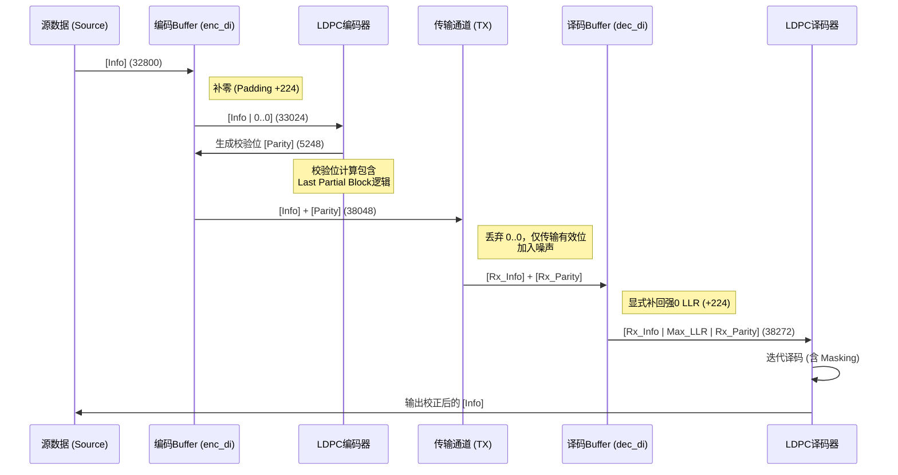

# Gen4 LDPC (DQ Version) 比特流完整细节文档

本文档详细描述了 Gen4 LDPC 仿真器 (DQ 版本) 中数据从产生、编码、传输到译码的全过程比特流细节及长度变化。

## 1. 核心参数定义

假设配置文件 (`.cnfg`) 参数如下：
*   **`h_m`**: 基矩阵校验行数 (逻辑值，如 20)
*   **`h_n`**: 基矩阵总列数 (逻辑值，如 149)
*   **`h_sc`**: 循环块大小 (扩展因子 Z，如 256)
*   **`pad_bit`**: 额外有效数据长度 (如 128)

**导出参数 (Physical)**:
*   **`bm_m`**: 物理基矩阵行数 = `h_m + 1` (21)
*   **`bm_n`**: 物理基矩阵列数 = `h_n + 1` (150)
*   **`mask_len`**: 掩码/无效长度 = `h_sc - pad_bit` (128)
*   **`drop_len`**: 保留/有效长度 = `pad_bit` (128)

---

## 2. 长度公式体系

| 参数名 | 计算公式 | 说明 | 典型值 (h_m=20, h_n=149, Z=256, pad=128) |
| :--- | :--- | :--- | :--- |
| **hm_m** | `bm_m * h_sc - mask_len`<br>或者 `h_m * h_sc + pad_bit` | **物理校验位总长** | 20*256 + 128 = **5248** |
| **hm_n** | `bm_n * h_sc - mask_len`<br>或者 `h_n * h_sc + pad_bit` | **物理码字总长** | 149*256 + 128 = **38272** |
| **hm_k** | `hm_n - hm_m`<br>或者 `(h_n - h_m) * h_sc` | **系统信息位总长** (LDPC 编码器输入容量) | (149-20)*256 = **33024** |
| **info_len** | `dsp_src_len + 32` | **用户有效载荷** (含MCRC) | 假设用户数据 4KB (32768) + 32 = **32800** |
| **pad_len** | `hm_k - info_len` | **编码前填充零的数量** | 33024 - 32800 = **224** |
| **blk_num** | `info_len + hm_m` | **信道传输有效块长** | 32800 + 5248 = **38048** |

---

## 3. 比特流全生命周期详解

### 阶段 1: 原始数据生成 (Source Generation)
*   **输入**: `Meta Data` + `LBA Data`
*   **操作**: 随机生成或读取文件。
*   **流结构**:
    ```
    [ Meta | LBA Data ]
    长度: dsp_src_len
    ```

### 阶段 2: 预处理与 MCRC (Preprocessing)
*   **操作**: 
    1. 插入 Meta 数据（如果需要）。
    2. 加扰 (Randomizer/Scrambling)。
    3. 计算并附加 32-bit MCRC 校验值。
*   **变量**: `usr_blk`
*   **流结构**:
    ```
    [ Meta | LBA Data | MCRC (32bit) ]
    长度: info_len
    ```

### 阶段 3: LDPC 编码准备 (Zero Padding / Shortening)
*   **目的**: 将不定长的用户数据对齐到 LDPC 矩阵要求的系统位长度 `hm_k`。
*   **操作**: 在 `usr_blk` 尾部填充 `0`。
*   **变量**: `enc_di_blk`
*   **流结构**:
    ```
    [ Meta | LBA Data | MCRC | 00...00 (pad_len个) ]
    <---------------- hm_k (33024) ---------------->
    ```

### 阶段 4: LDPC 编码 (Encoding)
*   **输入**: `enc_di_blk` (长度 `hm_k`)
*   **核心逻辑**: 
    *   使用 `(h_m+1) x (h_n+1)` 的扩展矩阵进行编码。
    *   矩阵最后一行一列通过 `mask_matrix` 标记为“部分有效”。
    *   生成的校验位长度为 `hm_m` (包含最后那个 `pad_bit` 长度的半块)。
*   **输出变量**: `enc_do_blk`
*   **流结构 (物理内存中)**:
    ```
    [ 系统位 (hm_k) ] + [ 校验位 (hm_m) ]
    <---------- hm_n (38272) ---------->
    ```
    *(注：此时系统位中仍包含填充的 0)*

### 阶段 5: 传输块构造 (Transmission Block Construction)
*   **目的**: 模拟真实信道传输，**去除无用的填充 0**。
*   **操作**: 从 `enc_do_blk` 中提取有效部分。
*   **变量**: `tx_blk`
*   **流结构**:
    ```
    [ Meta | LBA Data | MCRC ] + [ 校验位 ]
    <----- info_len --------->   <-- hm_m -->
    <----------- blk_num (38048) ----------->
    ```
    **注意**: 填充的 224 个 `0` **不**被传输。

### 阶段 6: 信道传输与接收 (Channel)
*   **操作**: 添加噪声 (AWGN/Eject Error)。
*   **变量**: `rx_blk` (LLR / Soft Info)
*   **长度**: `blk_num` (38048)

### 阶段 7: 译码前恢复 (Decoding Preparation)
*   **目的**: 恢复 LDPC 译码所需的完整码字结构。
*   **操作**: 
    1. 将接收到的 `rx_blk` 放入 `dec_di_blk` 的对应位置。
    2. **补回填充**: 在信息位尾部重新填充 **强判决为0的LLR** (即 `max_llr`)。
    3. **无效校验位处理**: 如果物理 Buffer (`hm_n`) 大于实际码字长，尾部多余部分（对应 `mask_len`）通常也被置为无效或 0。
*   **变量**: `dec_di_blk`
*   **流结构**:
    ```
    [ Rx_Info | Max_LLR(0)... | Rx_Parity ]
    <info_len> <--- pad_len --> <-- hm_m -->
    <------------- hm_n (38272) ----------->
    ```

### 阶段 8: LDPC 译码 (Decoding)
*   **操作**: 
    *   使用 `h_m+1` / `h_n+1` 矩阵进行迭代译码。
    *   **关键 Masking**: 在每次迭代的变量节点更新或校验节点计算时，针对最后一行一列的“无效区”（即 `mask_len` 长度部分），通过 `vec_mask` 强制清零或忽略，防止数据卷绕污染。
*   **输出**: `dec_do_blk` (硬判决结果，长度 `hm_n`)

### 阶段 9: 后处理 (Post-processing)
*   **操作**: 
    1. 去除填充的 0。
    2. MCRC 校验。
    3. 解扰 (Descrambling)。
    4. 提取 Meta 和 LBA 数据并比对。
*   **最终结果**: 统计误码率 (BER/FER)。

---

## 4. 数据流向图解


