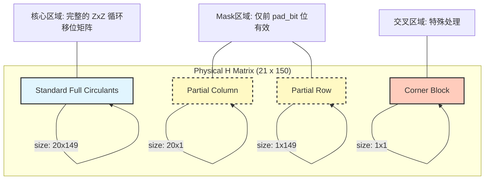
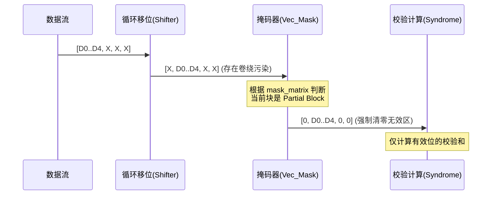

# Gen4 LDPC 仿真器：Padding & Masking 机制详解

## 1. 核心问题：任意粒度码长的支持

标准的 QC-LDPC (Quasi-Cyclic Low-Density Parity-Check) 码字长度由基矩阵大小 ($M \times N$) 和扩展因子 ($Z$, 即代码中的 `h_sc` 或 `cir_sz`) 决定。
标准码长公式为：
$$ Length = N \times Z $$

**问题**：在 SSD 等存储应用中，数据页（Page）大小加上元数据（Meta）往往不是 $Z$ 的整数倍。例如，我们需要 4KB 数据，但标准 QC-LDPC 可能提供 4.2KB 或 3.8KB 的粒度。

**解决方案**：Gen4 仿真器引入了 **Padding (填充)** 和 **Masking (掩码)** 机制，配合 **扩展的一行一列 ($M+1, N+1$)**，实现了对 `pad_bit` 粒度的精确控制。

---

## 2. 架构视图：Config vs. Physical

代码中出现的配置不一致（Config: 20x149 vs. Physical: 21x150）正是该机制的体现。

### 逻辑视图 (Config)
用户配置的是核心 LDPC 结构，不包含用于边界处理的特殊行列。
*   **h_m**: 20
*   **h_n**: 149

### 物理视图 (Implementation)
为了处理最后 `pad_bit` 长度的数据，物理矩阵在右侧和底部增加了一列和一行。
*   **bm_m**: $h\_m + 1 = 21$
*   **bm_n**: $h\_n + 1 = 150$



---

## 3. 详细处理逻辑

### 3.1 参数定义 (DQ版本)

在 `ldpc_codec_dq.cpp` 中：
*   **`cir_sz (sc)`**: 完整的循环块大小 (例如 256)。
*   **`pad_bit`**: 实际需要的有效数据长度 (例如 128，小于 256)。
*   **`drop_len`** = `pad_bit` (有效部分)。
*   **`mask_len`** = `cir_sz - pad_bit` (无效/被Mask掉的部分)。

### 3.2 矩阵读取与构建 (`ldpc_rd_phck`)

代码不仅仅是读取矩阵，还会根据 `mask_matrix` 对矩阵条目进行“截断”或“部分插入”。

*   **Mask Flag 1**（保留后段）：要求 `col_shift == drop_len % cir_sz`。只插入长度 `mask_len = cir_sz - pad_bit` 的条目，起始偏移为 `drop_len`，相当于保留后段、前段留空。
*   **Mask Flag 2**（保留前段）：要求 `col_shift == 0`。只插入长度 `drop_len = pad_bit` 的条目，起始偏移为 0，保留前段、后段留空。
*   **Mask Flag 0**：完整插入 `cir_sz` 条目。

这意味着在 H 矩阵的稀疏表示 (`mod2sparse`) 中，边缘的 Block 并不是全连接的，而是只有部分节点被连接。这从结构上保证了无效位不参与校验。

### 3.3 译码过程中的 Masking (`ldpc_dec_bf`)

这是最关键的步骤。在比特翻转（Bit-Flipping）或置信传播过程中，循环移位会导致“尾部”的无效数据“卷绕”到“头部”的有效数据区。**Masking 必须切断这种卷绕。**

代码逻辑示意：
```cpp
// 在循环移位后，立即对数据进行掩码处理
vec_shift(..., cn_flp_sel, ...);

if (mask_matrix[i][j] == 1) {
    // 保留后段：清零前段 drop_len
    vec_mask(cn_flp_sel, 0, drop_len, 0);
} else if (mask_matrix[i][j] == 2) {
    // 保留前段：清零后段 mask_len
    vec_mask(cn_flp_sel, cir_sz - mask_len, mask_len, 0);
}
```

#### 可视化：Masking 操作

假设 `cir_sz = 8`, `pad_bit = 5` (即有效长度 5)。
`drop_len = 5`, `mask_len = 3`。

**未 Mask 前 (Buffer):**
`[ D0 | D1 | D2 | D3 | D4 | X | X | X ]` (X 为无效数据/噪音)

**Shift 操作 (向右移 1 位):**
`[ X | D0 | D1 | D2 | D3 | D4 | X | X ]` (尾部的 X 卷绕到了头部，污染了数据！)

**Mask 操作后:**
通过 `vec_mask` 强制清零无效区，并配合算法逻辑忽略卷绕回来的无效位，确保：
1.  **校验方程 (Check Node)** 只计算前 5 位的校验和。
2.  **变量节点 (Variable Node)** 更新时，不接受来自无效区的消息。



---

## 4. 为什么需要 h_m + 1 ?

如果不增加这额外的一行一列，直接在原有的 $20 \times 149$ 矩阵上做 Mask：
1.  会导致第 20 行（最后一行）和第 149 列（最后一列）变成“残废”的行/列，其纠错能力大幅下降。
2.  **Gen4 策略**：保持前 $20 \times 149$ 个块是**完整、满秩**的强校验部分。额外增加的第 21 行和第 150 列专门用来承载那“多出来”的 `pad_bit` 数据。
    *   这样，主要数据的保护强度不受 Padding 影响。
    *   额外增加的边缘数据通过专门的 Partial Block 进行保护。

## 5. 总结

Gen4 LDPC 仿真器中的 **21x150 (Physical) vs 20x149 (Config)** 差异，本质上是一种**结构化的 Padding 方案**。

*   **Config**: 定义了核心的 LDPC 码率和基矩阵结构。
*   **Code Logic**: 自动添加一行一列，利用 `vec_mask` 技术实现部分循环移位（Partial Circular Shift）。
*   **目的**: 使 LDPC 码能完美适配 `(20*SC + pad_bit)` 这种非整块大小的实际工程数据长度，而无需在物理链路上由控制器进行低效的填充传输。

```
