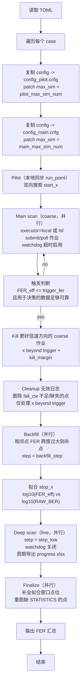
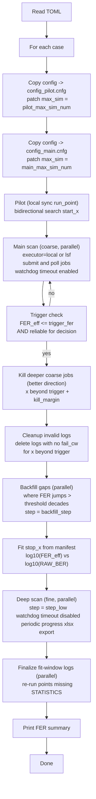
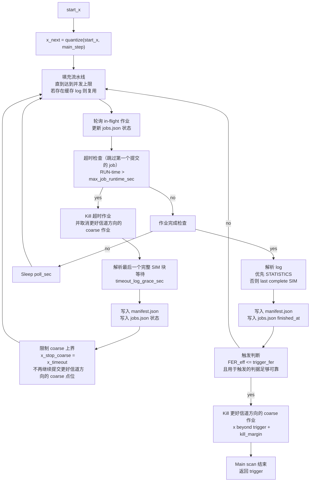
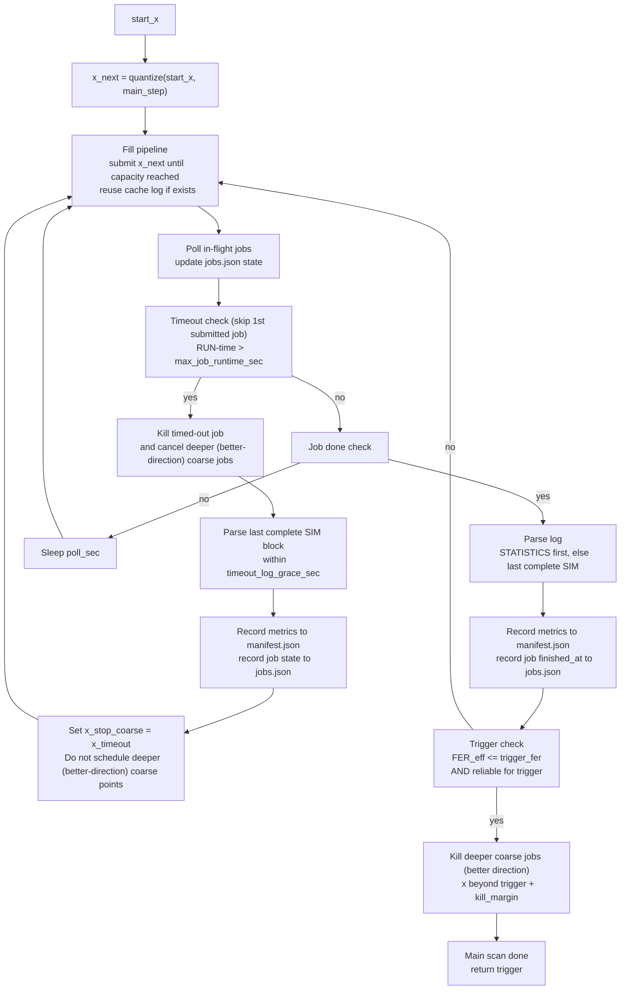

# auto\_fer\_eval：自适应点位搜索与作业调度（SNR/K，推荐）

本目录提供一个 **不依赖第三方库** 的 Python 脚本 `auto_fer_eval/auto_fer_eval.py`，用于在 AWGN/TAWGN/ERR\_INJ 信道下自动完成：

- **pilot**：定位瀑布区起点（工程判据：$FER\approx0.9\sim1$）
- **main scan**：按固定步长（默认 0.1 dB）向更好信道方向扫描，并发提交作业
- **trigger + kill**：当任一点满足 $FER_{eff}\le 10^{-4}$ 时，立即 kill 所有“更好信道方向”的 in-flight coarse 作业（默认无 margin）
- **watchdog（可选）**：若某个 coarse 点在 RUN 态运行超时（例如 3 小时），自动 kill，并解析日志中最后一个完整 `[SIM]` 块；同时限制 coarse 扫描上界，避免重复提交更深 SNR 的 coarse 点位
- **deep scan**：用 $10^{-2}\sim10^{-4}$ 区间点对 `RAW BER`–`FER` 做双对数拟合估计 stop，并按 0.1/0.05/0.025 dB **并行**下探直到目标深度（fine 阶段默认不启用 watchdog）
- **completion pass（全点补全）**：对被 kill 或提前结束后留下的半截 log，若未达到 cnfg 中的 `maximum error number`（通常 10）或缺少最终 `[STATISTICS]` 段，则自动删除并重跑，保证最终保留的点位日志完整
- **finalize（fit-window）**：对参与拟合窗口内的点优先补齐完整统计块，降低后续拟合/汇报对半截 log 的依赖
- **progress xlsx（deep/finalize/completion阶段）**：进入 deep scan 或后续 `finalize/completion` 补跑阶段后，每隔 `export_xlsx_sec` 秒导出/刷新一次 `*.xlsx` 进度表；阶段开始和新 job 提交后还会立即刷新一版，避免长轮询间隔下看不到 in-flight 进度（允许半截 log；缺失字段留空；增加 `IsComplete` 标志）；LSF 下会优先读取 job 实际日志路径，并在需要时通过 `bpeek` 补抓运行中 stdout
- **时间戳**：所有脚本状态输出行末尾追加绝对时间 `[YYYY-mm-dd HH:MM:SS]`，便于对齐 LSF 作业时序与排障

本 README **只描述推荐的 `adaptive` 工作流**。脚本仍保留 `run/pilot` 的旧接口，但不再在此展开。

---

## 0. 你需要准备什么（最小前提）

### 0.1 C++ 仿真命令格式必须匹配

脚本假设可执行程序的命令行形如：

`<exe> <sim_mode> <config.cnfg> <ch_model> <ch_para> [extra...]`

例如（本仓库常见）：

`./ssd_fc_flip_eq LDPC config/21x150_hre0_dis.cnfg AWGN 3.7 0 ./matrix`

其中 `extra...` 由你在配置里通过 `cmd_extra_args` 提供（例如 `matrix_id` 与 `matrix_dir`）。

`ch_para` 的含义由 `ch_model` 决定：
- `AWGN/TAWGN`：`ch_para` 为 SNR（浮点数，单位 dB）
- `ERR_INJ`：`ch_para` 为注错数量 $K$（整数）

重要：本仓库里 `SSD_FC.cpp/SSD_FC_flip_eq.cpp/SSD_FC_hre2.cpp` 在 AWGN/TAWGN 等非 `CLEAN` 模式下解析参数为：

- `argv[5]`：可选 `matrix_id`（整数；不提供则默认 0）
- `argv[6]`：可选 `matrix_dir`（不提供则用环境变量 `LDPC_MATRIX_DIR`，再否则默认 `./matrix`）

因此如果你想显式指定矩阵目录，`cmd_extra_args` 应写成：

- `cmd_extra_args = ["0", "./matrix"]`

只写 `cmd_extra_args = ["./matrix"]` 会导致它被当作 `matrix_id` 位置，从而矩阵目录参数缺失。

### 0.2 日志至少要能解析出 `LDPC FER`

解析器优先读取 `[STATISTICS]`，若仿真未正常结束，则回退到最后一个完整 `[SIM] Statistical result ...` 块。

最低要求：日志中能出现以下任意一类行并可被解析到数值：

- `[STATISTICS] LDPC FER  : <num>`
- `[SIM] LDPC FER  : <num>`

可选字段（用于拟合/更稳健判断）：

- `RAW BER`、`TheoRBER`
- `Total packets simulated`

---

## 1. 运行方式（adaptive）

命令：

`python3 auto_fer_eval/auto_fer_eval.py adaptive --config <your_case>.toml`

说明：
- `adaptive` 支持两类轴（默认可按 `ch_model` 自动推断）：
  - `axis_type=snr`：适用于 `AWGN/TAWGN`（自变量为 SNR）
  - `axis_type=k`：适用于 `ERR_INJ`（自变量为 $K$）
- 若你在无 LSF 的环境下想先验证调度逻辑，可用 `executor=local`。

---

## 2. adaptive 在做什么（严格按实现描述）

对每个 `case`，执行顺序如下：

## 2.0 调度流程图（Mermaid，建议先看）

### 2.0.1 单个 case 的端到端流程

#### 中文版



#### English version



要点（容易误解的两点）：
- Pilot 阶段目前是 **本地同步** 执行（`run_point()` 直接 `subprocess.run`），不走 LSF；因为 pilot 预算很小（例如 100 packets），通常足够快。
- Main/Backfill/Deep 阶段才使用 `executor`（`local` 或 `lsf`）提交/轮询/kill 作业。
  - Main scan 是 coarse 扫描（固定 `main_step`），**启用超时 watchdog**；
  - Backfill 和 Deep scan 都是 **并行提交**，**禁用超时 watchdog**（必须允许点位完整跑完）。

### 2.0.2 Main scan 内部调度（触发、回退、超时）

#### 中文版



#### English version



说明：
- `capacity` 来自 `startup_ok_required`：在成功解析到足够多点位之前只允许 1 个 in-flight；之后使用 `max_in_flight` 并发提交。
- “reliable” 使用 `min_fail_cw_for_decision=K`：当日志里能解析到 `FAIL CW` 且小于 K，该点仍会写入 `manifest.json`，但不用于 `fit` 等需要稳定统计的决策；对 `trigger` 还额外允许使用保守上界 $3/N$（即 `FER_eff`）来触发停止。
  - Main scan 不做 `step_low` 回填；超时只负责 **kill + 解析 + 限制 coarse 扫描上界**（避免重复提交更深 SNR 的 coarse 点位）。
  - 但被保留下来的 partial coarse 点不会作为最终结果结束；脚本会在后续 completion pass 中补跑到 cnfg 里的 `maximum error number`。

### 2.1 pilot（同步执行，双向搜索起点）

从 `snr_init` 出发做粗扫（步长 `pilot_step`；注意该参数名沿用历史，实为 axis seed：SNR 或 $K$），按以下规则双向移动：

- 若当前点 $FER\le fer\_hi$（说明“太好”），向更差信道方向移动，直到找到一个 $FER>fer\_hi$ 的点形成 bracket；
- 若当前点 $FER>fer\_hi$（说明“太差”），向更好信道方向移动，直到首次满足 $FER\le fer\_hi$；
- 若首次满足 $FER\le fer\_hi$ 的点“过好”（$FER<fer\_pilot\_too\_low$），脚本会在 bracket 内用 `0.1/0.05/0.025` 逐级回填，尽量把边界拉回到 $FER\approx0.9$ 附近；
- 最终返回 `start_x = found_low_at - direction*low_margin`（回退一点，确保起点更接近 $FER\approx1$）。

### 2.2 main scan（并发提交，固定步长）

从 `start_x` 出发，按 `main_step` 逐点向“更好信道方向”扫描；并发上限为 `max_in_flight`。

作业由执行器提交：
- `executor="lsf"`：使用 `bsub/bjobs/bkill` 提交/轮询/取消
- `executor="local"`：本地 `Popen` 提交/轮询/kill（仅用于验证逻辑）

### 2.3 触发与 kill（你关心的核心逻辑）

当任一点完成并满足 $FER_{eff}\le trigger\_fer$（默认 $10^{-4}$）时，记为 `trigger`，并立即 kill 所有处于“更好信道方向”且满足 `kill_margin` 条件的 in-flight coarse 作业（你要求“不保留”，因此建议 `kill_margin=0`）。

此外（coarse watchdog 行为）：为避免 warm-up 误杀，main scan 的第一个实际提交作业默认不参与超时判断；其余 coarse 点若在 RUN 态运行时间超过 `max_job_runtime_sec`，脚本会：

- kill 该点，并取消所有“更好信道方向”的 coarse in-flight 作业
- 尽力解析日志里最后一个完整 `[SIM]` 块（等待 `timeout_log_grace_sec` 秒刷盘）并写入 `manifest.json`；若仍解析不到 `LDPC FER`，则仅告警并跳过该点（下次重启可能解析成功）
- 将 coarse 扫描上界更新为 $x\\_stop\\_coarse=x\\_{timeout}$，从而 **不再提交更好信道方向的 coarse 点位**

### 2.4 backfill（并行回填）

当 main scan 完成后，若相邻点 FER 跳变超过 `backfill_decade_threshold`（默认 2.0，即 100 倍），脚本会用 `backfill_step`（默认 `step_mid`）回填中间点。

- 回填在 deep scan **之前**执行，以便回填点可以参与 fit 估计 stop\_x；
- 回填使用并行提交，受 `max_in_flight` 限制。

### 2.5 deep scan（并行下探）

当 main scan 已触发 `snr_trigger`（或有已完成点）后：

- 若启用 `fit_enable`，脚本会在已完成点里筛选 $FER_{eff}\in[fit\_fer\_lo,fit\_fer\_hi]$（默认 $10^{-5}\sim10^{-1}$）且具备 `RAW BER` 的点，对 $\log_{10}(FER_{eff})$–$\log_{10}(RAW\_BER)$ 做线性拟合，并据此估计达到 `fit_target_fer` 所需的 stop\_x：
  - `axis_type=snr`：先由拟合得到目标 `RAW_BER`，再按 `src/transceiver.cpp` 的 `snr->rber` 关系做逆变换反推 stop SNR（脚本会从已完成点的 `TheoRBER`（若缺失则回退 `RAW_BER`）反推出常数偏移 $snr\\_{code}-snr$，以匹配代码率项）
  - `axis_type=k`：通过估计 $N\\approx\\mathrm{median}(K/RAW\\_BER)$ 反推 stop $K$
- 随后从 `trigger`（或最低 FER 点）到 stop\_x 之间，按 `step_low` 生成所有点位，**并行提交**（受 `max_in_flight` 限制）；
- 当任一点达到 $FER_{eff}\le fer\_lo$ 时，取消剩余 in-flight 作业并结束。

### 2.6 finalize / completion（补全最终统计块）

由于 main scan/watchdog/kill 允许使用日志中最后一个完整 `[SIM]` 块做临时决策，可能会产生“可解析但不含 `[STATISTICS]`”的 **半截 log**。

为保证最终用于拟合/汇报的数据一致性，脚本会做两层补全：

- 第一层：在 main scan 之后，优先对已提交过的 coarse 点做 completion pass。若日志缺少 `[STATISTICS]`，或 `FAIL CW < maximum error number`，则删除旧 log 并重跑该点。
- 第二层：在 deep/finalize 结束后，再对当前 case 下所有已保留点做一次 completion pass，确保最终留下的日志都达到 cnfg 中设定的 `maximum error number`。
- fit-window finalize 仍然保留，用于优先保证拟合窗口点位的完整性。

动作：删除旧 log 并重跑该点，直到产出包含 `[STATISTICS]` 的完整 log，且 `FAIL CW` 达到 cnfg 中的 `maximum error number`（并行提交，受 `max_in_flight` 限制）。

---

## 3. $FER_{eff}$ 的定义（用于 trigger/步长/拟合）

为避免 `FER=0` 无法取对数，脚本使用保守估计：

- 若 `LDPC FER > 0`，则 $FER_{eff}=FER$；
- 若 `LDPC FER = 0` 且能解析到包数 $N$，则 $FER_{eff}\approx 3/N$（95\% 上界近似）。

---

## 4. 输出目录结构（adaptive）

对每个 `case.name`，输出在：

- `out_dir/<case.name>/adaptive/pilot/`
  - `<log_prefix>_pilot_snrX.log` 或 `<log_prefix>_pilot_kX.log`
  - `manifest.json`
- `out_dir/<case.name>/adaptive/main/`
  - `<log_prefix>_snrX.log` 或 `<log_prefix>_kX.log`
  - `manifest.json`
  - `jobs.json`（任务状态数据库：记录 bsub/job_id、状态迁移、kill 原因、时间戳；stage=main/backfill/deep/finalize_fit）
- `out_dir/<case.name>/adaptive/config_pilot.cnfg`
- `out_dir/<case.name>/adaptive/config_main.cnfg`
- `out_dir/<case.name>/adaptive/<log_prefix>_progress.xlsx`（deep scan 阶段周期性刷新）

配置副本说明：
- `config_pilot.cnfg` / `config_main.cnfg` 都由脚本从你给的 `config` 复制生成；
- `config_pilot.cnfg` 会改写 `maximum simulation number` 与 `maximum error number = 0`；
- `config_main.cnfg` 会改写 `maximum simulation number`，并强制写入 `maximum error number = 10`（供 main/backfill/deep/completion pass 共用）。

---

## 5. 配置文件（TOML）详解：怎么写才能跑起来

一个可工作的配置文件至少包含三块：

- `[defaults]`：公共默认参数（必选）
- `[adaptive]`：adaptive 参数（必选）
- `[[cases]]`：case 列表（必选，至少 1 个）

如果你要跑 LSF，再加：

- `[lsf]`：bsub/bjobs/bkill 参数（可选）

### 5.1 `[defaults]`：描述“如何调用 C++ 程序”

必须/常用字段：

- `workdir`：运行命令的工作目录（通常 `"."`）
- `exe`：可执行文件（例如 `"./ssd_fc_flip_eq"`）
- `sim_mode`：第 1 个参数（例如 `"LDPC"`）
- `config`：原始 `.cnfg` 路径（脚本会生成 `config_pilot.cnfg/config_main.cnfg`）
- `ch_model`：信道模型字符串（例如 `"AWGN"` 或 `"TAWGN"`）
- `cmd_extra_args`：在 `ch_para` 后追加的参数数组（例如 `["0","./matrix"]`）
- `out_dir`：输出根目录
- `log_prefix`：日志前缀（建议不同实验改前缀避免混淆）

扫描范围与判据：

- 扫描范围（按轴类型二选一）：
  - `axis_type=snr`：`snr_min` / `snr_max`
  - `axis_type=k`：`k_min` / `k_max`
- `fer_hi`：瀑布区起点判据（推荐 0.9）
- `fer_lo`：深挖停止判据（例如 $10^{-6}$；按预算也可设 $10^{-5}$）

pilot 相关（adaptive 会用到）：

- `pilot_step`：pilot 粗扫步长（推荐 0.5 dB）
- `low_margin`：起点回退量（把边界向更差信道方向回退一点）
- `fer_pilot_too_low`：若首次边界点过好（如 <0.1），则 bracket 内回填细点

deep scan 的步长策略（adaptive 会用到）：

- `step_default/step_mid/step_low`：默认/中/低步长（推荐 0.1/0.05/0.025）
- `fer_mid/fer_low`：分段阈值（推荐 $10^{-4}$ / $10^{-5}$）
- `slope_max_decades`：斜率保护阈值（单位 decade/step，默认 0.5；即单步最多跨越 0.5 decade）

拟合参数（adaptive 会用到）：

- `fit_enable`：是否启用拟合估计 stop
- `fit_fer_hi/fit_fer_lo`：参与拟合的 $FER_{eff}$ 范围（推荐 $10^{-1}$ / $10^{-5}$，即"数量级"解释）
- `fit_target_fer`：拟合外推目标深度（通常等于 `fer_lo`）
- `fit_stop_margin`：拟合得到的 stop 额外加的 margin（默认 0.05 dB）
- `fit_min_points`：启用拟合需要的最少点数（默认 3）

提示（避免误解）：
- `fer_pilot_stop`、`snr_span_cap`、`fit_max_extend` 等参数属于旧接口；adaptive 当前不会用到。

### 5.2 `[adaptive]`：描述"如何调度作业"

- `enable`：必须为 `true`
- `executor`：`"lsf"` 或 `"local"`
- `snr_init`：pilot 起点（可选；不填则用 `snr_min`）
- `pilot_max_sim_num`：pilot 阶段写入 `config_pilot.cnfg` 的 `maximum simulation number`（你通常设 100）
- `main_max_sim_num`：main/deep 阶段写入 `config_main.cnfg` 的 `maximum simulation number`（你当前设 1000）
- `main_step`：main 扫描步长（可选；不填则用 `step_default`，默认 0.1）
- `trigger_fer`：触发 kill 的阈值（可选；不填则用 `fit_fer_lo`，推荐 $10^{-3}$）
- `max_in_flight`：最多并发点位数（越大越并行，但越可能跑过头）
- `poll_sec`：轮询间隔（秒；越小触发 kill 越快，但 `bjobs` 调用更频繁）
- `kill_margin`：触发后保留的 SNR margin（你要求不保留，因此设 0）
- `startup_ok_required`：启动门控（熔断保护）。在成功解析出至少 $N$ 个点位之前，只允许 **1 个** in-flight 作业；用于避免参数/矩阵目录错误时批量生成废 log（默认 1）。
- `fail_fast`：是否启用熔断。一旦出现"作业 EXIT"或"日志无法解析出 `LDPC FER`"，立即停止并取消所有 in-flight 作业（默认 true）。
- `min_fail_cw_for_decision`：决策可靠性门槛（默认 2）。若能解析到 `FAIL CW` 且其小于该值，则该点仍会写入 `manifest.json`，但不会用于 `fit` 等需要稳定统计的决策；对 `trigger` 允许使用保守上界 $3/N$（即 `FER_eff`）触发停止。
- `max_job_runtime_sec`：单点 RUN 态超时（秒；默认 0 关闭）。**仅作用于 main scan（coarse）**；backfill 和 deep scan 默认禁用超时以保证点位完整跑完。常用 10800（3 小时）。
- `timeout_log_grace_sec`：日志刷盘等待时间（秒；默认 10）。用于两类场景：1) coarse watchdog 超时 kill 后重试解析；2) LSF 下 bjobs 已显示 DONE 但 `-o` 日志尚未完全落盘时的重试解析（LSF 下会强制至少等待 30 秒）。
- `backfill_step`：回填步长（可选；不填则用 `step_mid`，默认 0.05）。当相邻点 FER 跳变超过 `backfill_decade_threshold` 时，用此步长回填中间点。设为 0 禁用回填。
- `backfill_decade_threshold`：触发回填的 FER 跳变阈值（默认 2.0，即 100 倍）。
- `export_xlsx_sec`：deep scan 阶段周期导出 xlsx 的时间间隔（秒；默认 3600；设为 0 禁用）。xlsx 文件名为 `out_dir/<case.name>/adaptive/<log_prefix>_progress.xlsx`，字段包含：`SNR,RAW_BER,LDPC_FER,FAIL_CW,PACKETS,AvgIter,IsComplete,JobState,Stage,LogPath`。其中 `IsComplete=1` 的判据为日志中出现 `[STATISTICS] LDPC FER` 且 `FAIL CW` 达到 cnfg 中的 `maximum error number`。若点位仍在运行，导出会优先读取当前日志内容；LSF 下若共享盘日志暂未及时刷新，会额外尝试 `bpeek` 获取最新 stdout 统计。

### 5.3 `[lsf]`：只在 `executor="lsf"` 时生效

- `queue`：默认队列（`bsub -q <queue>`）
- `queue_slow`：pilot/main/backfill 阶段使用的队列（不填则用 `queue`）
- `queue_fast`：deep scan 阶段使用的队列（不填则用 `queue`）
- `log_base_dir`：LSF 日志输出基础目录（可选）。若设置，日志会输出到 `log_base_dir/<case_name>/adaptive/main/*.log`，保持 case 目录结构。不设置则使用 `out_dir`。
- `bsub_extra`：额外 bsub 参数数组（例如资源申请）
- `bjobs_extra`：额外 bjobs 参数数组
- `bkill_extra`：额外 bkill 参数数组

排障提示（LSF）：
- 若 `bjobs` 命令在当前环境不可用/偶发失败（例如 PATH/环境模块问题），脚本会打印一次告警，并尝试用日志内容做 best-effort 状态推断（有 `LDPC FER` 则视为 DONE；否则视为 RUN/UNKNOWN）。建议优先确保 `bsub/bjobs/bkill` 在同一环境下均可正常调用（例如先手动执行 `which bjobs`、`bjobs <jobid>`）。

### 5.4 `[[cases]]`：批量 case 与覆盖机制

每个 `[[cases]]` 至少需要：
- `name`：用于输出目录命名。允许包含 `/`，会形成多级目录。

其余字段均可覆盖 `[defaults]`（例如不同矩阵、不同译码器配置、不同信道模型）。

注意：`[adaptive]` 与 `[lsf]` 当前是全局的，不能 per-case 覆盖；若不同 case 需要不同调度参数，建议拆成多个配置文件分别运行。

---

## 6. 一个"可直接改成你真实环境"的配置模板  

建议从下面模板复制修改：

```toml
[defaults]
workdir = "."
exe = "./ssd_fc_flip_eq"
sim_mode = "LDPC"
config = "config/21x150_hre0_dis.cnfg"
ch_model = "TAWGN"
cmd_extra_args = ["0", "./matrix"]

out_dir = "./perf_auto"
log_prefix = "run"

snr_min = 3.2
snr_max = 4.6

fer_hi = 0.9
fer_lo = 1e-6

pilot_step = 0.5
low_margin = 0.1
fer_pilot_too_low = 0.1

step_default = 0.1
step_mid = 0.05
step_low = 0.025
fer_mid = 1e-4
fer_low = 1e-5
slope_max_decades = 0.5

fit_enable = true
fit_fer_hi = 1e-1
fit_fer_lo = 1e-5
fit_target_fer = 1e-6

[adaptive]
enable = true
executor = "lsf"
snr_init = 3.2
pilot_max_sim_num = 100
main_max_sim_num = 1000
# main_step = 0.1        # 可选，默认用 step_default
# trigger_fer = 1e-3     # 可选，默认用 fit_fer_lo
max_in_flight = 10
poll_sec = 60
kill_margin = 0.0
min_fail_cw_for_decision = 2
max_job_runtime_sec = 10800
timeout_log_grace_sec = 10
# backfill_step = 0.05   # 可选，默认用 step_mid
backfill_decade_threshold = 2.0

[lsf]
queue = "normal"
queue_slow = "slow"      # pilot/main/backfill 使用慢队列
queue_fast = "fast"      # deep scan 使用快队列
# log_base_dir = "/scratch/lsf_logs"  # 可选：LSF 日志输出目录
# bsub_extra = ["-R", "rusage[mem=4000]"]

[[cases]]
name = "rate0p9/decoderX/cfgY"
```

---

## 7. 你最需要调的 3 个旋钮（减少冗余与跑过头）

1) `max_in_flight`：越大并行越高，但越可能在触发前提交很多高 SNR 点；若你主要目标是减少冗余，建议先用 4~6。

2) `poll_sec`：越小触发 kill 越及时；但会增加 `bjobs` 压力。工程上常用 30~120 秒。

3) `main_step`：主扫步长。你当前策略是 0.1；若瀑布区极窄导致跳变大，可减到 0.05，但会显著增加点数。

补充（B 方案关键）：

- `max_job_runtime_sec`：用于避免 coarse(main scan) 在低 FER 区域耗时失控；一旦触发超时，脚本会 kill 该点并限制 coarse 扫描上界（不再继续提交更高 SNR 的 coarse 点位）。

---

## 8. 常见现象与排查（你之前遇到的那类问题）

1) “为什么 3 秒就结束？”
- 若对应点位的 log 已存在且可解析出 `LDPC FER`，脚本会 **直接复用缓存**（`trigger(from cache)`），不会再提交作业，因此会非常快。
- 清理缓存的方式是：删除对应输出目录 `out_dir/<case.name>/adaptive/*/*.log` 或清空 `manifest.json`（按需）。

2) “矩阵路径读错导致大量废 log，怎么办？”
- 首先保证 `cmd_extra_args` 必须是数组，例如：`cmd_extra_args = ["0", "./matrix"]`。
- 其次把 `[adaptive] startup_ok_required` 设为 1~3，并保持 `fail_fast=true`：这样在第一个点没跑通之前不会批量提交。

3) “多个译码配置同时跑脚本，会互相 kill 吗？”
- 不会。`executor="lsf"` 时脚本只会对 **自己提交得到的 job_id** 调用 `bkill`；不会按 job name 模糊匹配去杀别人的任务。
- 可能冲突的是 **输出路径**：若两个脚本实例写到同一个 `out_dir/<case.name>/adaptive/main/<log_prefix>_snrX.log`，会发生覆盖/复用缓存。避免方法：确保不同配置使用不同 `case.name` 或不同 `log_prefix`（推荐两者都区分）。
